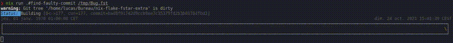

# Nix Flake F* Extra

Building on https://github.com/W95Psp/nix-flake-fstar, this repository is a flake which provides:
 - a list of F* master commits with their sha256 hashes (`nix eval --json 'github:W95Psp/nix-flake-fstar-extra#commits'`);
 - corresponding F* binaries (e.g. `nix run 'github:W95Psp/nix-flake-fstar-extra#fstar-bin-02ecab9dd1aa930bee842d77fa3564f24328e3d7' somemodule.fst`);
 - a list of F* pull-request patches with their sha256 hashes (`nix eval --json 'github:W95Psp/nix-flake-fstar-extra#commits'`);
 - corresponding patches (e.g. `nix build 'github:W95Psp/nix-flake-fstar-extra#pr-1909' -o 1909.patch` fetches the patch `1909.patch`);
 - a tool to find regressions (see below).

## Finding regressions
**Scenario:** *a function used to typecheck at some point (with some F* version). You want to identify the commit in F* history which broke your function*.

The following command will perform a dichotomic search to find the commit in the F* master branch history that breaks module `MODULE`. Timestamps `TIMESTAMP_MIN` and `TIMESTAMP_MAX` can be specified to slice the master branch history.

`nix run 'github:W95Psp/nix-flake-fstar-extra#find-faulty-commit' MODULE [TIMESTAMP_MIN] [TIMESTAMP_MAX]`

<!-- Note: to exclude intermediary commits from pull-requests, prepend `GIT_LOG_EXTRA_FLAGS="--first-parent master"` to the command. This will drastically reduce the number of commits to consider. -->

## Details

  
Full list of attributes availables

<!-- LIST -->
 - `fstar-bin-0014ac13070209d706914c61600d819a62956198`
 - `fstar-bin-001bc12935f5acf01cee99733bb653b645dbd5b5`
 - `fstar-bin-0063a9a2947ee5ff138bd1802fcb8670123e719e`
 - `fstar-bin-006d9abe10bd8368fae16fb90aaa26e320d9ba6d`
 - `fstar-bin-007eab55a518a1f58a7eb1f1e94a3a10ed20e216`
 - `fstar-bin-008228f4a1f3acd27f29055562814adb14e0a3ea`
 - `fstar-bin-00a4c9310172a9d70d6429ceb9367a7ec53a6081`
 - `fstar-bin-00b20bda7f2b9a8a7f63d2080a9e24f8eed1428e`
 - `fstar-bin-00c8bf9995b94cd17da4fe5e68210e3e4eaf3ea3`
 - `fstar-bin-0117e72dcc222e951b12ff00e986e027e7ac98e5`
 - `fstar-bin-011fd4c35bbdf19767f0ae94fd764de80b166097`
 - `fstar-bin-0157c60c480f0118f1c4066da06892ed50d5f179`
 - `fstar-bin-01a04d1319c6c98f0869750c22531e11afdabe50`
 - `fstar-bin-01eceefb231add9bb2db9f55d7fc3b8a73152534`
 - `fstar-bin-0204695d64d5058da0080b39931bde135bc80fc8`
 - `fstar-bin-0210b1c41f96de01cb86add0bced4a9286c03689`
 - `fstar-bin-022a59bcf2d228d4f0c389f346cd2f1c2494dec0`
 - `fstar-bin-0242a66efbce543e7db8b352b6e93bbde0e7e8a0`
 - `fstar-bin-0247e6674307954242ee16fb5919beb5b2e43096`
 - `fstar-bin-0285b7874562579cfde5161223be65d6553a4ebf`
 - `fstar-bin-028bd2629de831c4a948fc74b1ad6c3eea669350`
 - `fstar-bin-02c6960b866cc1bd80f75d4c8c786a2f85988ad7`
 - `fstar-bin-02c6f67bb8970239401807e34450254ab0cb2b69`
 - `fstar-bin-02ecab9dd1aa930bee842d77fa3564f24328e3d7`
 - `fstar-bin-02eef09ecafebbb9ded1cc475ec3f7353cdf8553`
 - `fstar-bin-02fdd69420f568af6066e1ff788d5ca22fc29073`
 - `fstar-bin-0311496b00a7f1fc6f59088e030356c8b7faf505`
 - `fstar-bin-032740de9fb9f9448a7b008815a216c6312cf739`
 - `fstar-bin-03643f466e665cc6656d5211d532461ca8e6a57b`
 - `fstar-bin-03759f9a1a73a6bae4b72e2aa42b7624005d74ea`
 - `fstar-bin-037f439b7704f4a105d15b7f4c6a06e16f60e5c7`
 - `fstar-bin-03c0a42f4586968baae0794398c1e36901c2165f`
 - `fstar-bin-041d6ceb8f2af78fae8a36f2844655300dcbcc30`
 - `fstar-bin-04309438d078fbc13851d8f08e7279251bc57795`
 - `fstar-bin-044c114ea3e772f4ff32ee8236bc0311e7583c14`
 - `fstar-bin-045a8e12422f9310212da7f30d839ebb2740adb0`
 - `fstar-bin-047ea32a6c831f6a5cf0c0ed3d8c9569feb67668`
 - `fstar-bin-04c4e96161a06c6f98324776eed253e83dea9a49`
 - `fstar-bin-050840c7276b51883906976e2491e9ae999a2326`
 - `fstar-bin-051b6c4cc6402ecfb516e3054561760024879f8b`
 - `fstar-bin-0529c61e66a4a33542779eb6f95755529b44640a`
 - `fstar-bin-0581a15d16f389d91999b02e594a837bf3d7d598`
 - `fstar-bin-058826e8290c21cc89799f47c3874e5bffa3ddc3`
 - `fstar-bin-05c7cddcdcd50fbeb887a3dbfa11c59a62695c78`
 - `fstar-bin-05db6bab93d9045e4d81de5693bbc764d2867d83`
 - `fstar-bin-05ec17ee4bf163b4a00c2aa2156eca23ff4406a7`
 - `fstar-bin-0601978e78abe9e520ac2af31ad9859ce493942a`
 - `fstar-bin-0606fcf8b21443daf98faa50b13296a65a4db521`
 - `fstar-bin-061b58266f0ef0daca5e7f710415bc4165faa87f`
 - `fstar-bin-0622cce972c75d7bb63009dc70c9f2d43b99c7db`
 - `fstar-bin-066ab73de08988bf1dd4916b38b6862da1db2e0c`
 - `fstar-bin-0677544b914e30ec56cae19f0e746fcff35c18ce`
 - `fstar-bin-06893cf3cbf8207e73380623514db4686881b25e`
 - `fstar-bin-06d501d65515249d522268940ff17a99beb035dc`
 - `fstar-bin-07351229e38fdb6a90b3355932e0588f7272d56d`
 - `fstar-bin-077fc856252185782bf6b9874bb0c05f5e627f0d`
 - `fstar-bin-07afbfe02edae4f95c8603712991bfef1e43ac4e`
 - `fstar-bin-07ee7cd9465295c14b44a9cf19a3335a42e9ef7b`
 - `fstar-bin-0840ab41632ffc7e5ef3a95dbd0bb6d1f82ffbcd`
 - `fstar-bin-087bb38dfcf9b82d0615125186b27669e4954baa`
 - `fstar-bin-088c54e4e7e01600da7e3edd787bbaed699cbb8c`
 - `fstar-bin-08c4bdcca70823b7321d2397674c450f16875ef4`
 - `fstar-bin-08dd05039f8d76675b467fa4bd8cc732f15c26f8`
 - `fstar-bin-090b2afffba0b4b49e7fea64c6279c7ccdd44c8b`
 - `fstar-bin-091f30ef55af5ed25ec726745444d105282854b0`
 - `fstar-bin-0976a27247a39f14f06162786091402b0eb02cab`
 - `fstar-bin-098eacb8a1e7da727566d758a272973ef09d27a9`
 - `fstar-bin-099df1b2c60914736be30ced5dbe20b5cafeab72`
 - `fstar-bin-09dfb07c7f0595c89a2fdbc636c60548171044af`
 - `fstar-bin-09ec156685845a9a8f816a51bbecda27fd15dff6`
 - `fstar-bin-0a478ef6574b5e0769400a1ca49cc8e83f67894b`
 - `fstar-bin-0a49a1ca557f424708688f384fcd749a8d58e035`
 - `fstar-bin-0a6236c65a49d62ea8557745e2635da2c0e393db`
 - `fstar-bin-0a79a2e7bd2bf29dacd860b549b84714a0fa225e`
 - `fstar-bin-0aa1bdbaed1aeb5af2caa67fd77bb6a4f81f33ad`
 - `fstar-bin-0aa71a28cc6356a11c9ccf57ed6881c112b53dd7`
 - `fstar-bin-0aac127e78b516a9b7d2be54e8b4438005c8f774`
 - `fstar-bin-0ab7c9d6b5e9892437eedd60f9993eceb4e4ca72`
 - `fstar-bin-0ad79e64adb21cb2fe6bd2b9a4035904758fa800`
 - `fstar-bin-0add2f9e0b6c26f2caf272fcb4ecbb1c66072317`
 - `fstar-bin-0b5e46f14d56aa4845cc09a4fd03198bb52deba6`
 - `fstar-bin-0b88dba321ad1d1ee4ee0ad1fdb3cecc77c6da1c`
 - `fstar-bin-0b90e2c7f16855098173b9008a8ae3eb8332dbf4`
 - `fstar-bin-0b9ddb36a143a012c711f40881e3d8dfcafebd84`
 - `fstar-bin-0ba2c693a4f6e22962d60afe7a4930d9c4785d0c`
 - `fstar-bin-0ba56db7ea0c854892b0f7ddf68d9ff00abd743a`
 - `fstar-bin-0bb1ecb235bf1820747a256e20a58c11f39b14d6`
 - `fstar-bin-0bc8c41207a36fb78240eea47bad1f72031f52cf`
 - `fstar-bin-0bcc6a86219c4f43f04b88e7756240fac9adb07e`
 - `fstar-bin-0bd8166a846a55fe964b32e88fbf59c27a59691a`
 - `fstar-bin-0c07b2586e2ddcadc69fba42294daea53296add9`
 - `fstar-bin-0c2113f031145930dfc50fe461e234e55695a09b`
 - `fstar-bin-0c48ec3706c60b94422b8b4612aa4b12a27f9bc4`
 - `fstar-bin-0c4b30fa81a8ac93ac40be94a825d9493d4d4807`
 - `fstar-bin-0c53756d0061e055bea7e1c2041c68bbe5a0eb60`
 - `fstar-bin-0c570536389763b07c16765b83ade172cffd5017`
 - `fstar-bin-0c648b2006abf90506f0754ac75a6baa80f1ab3b`
 - `fstar-bin-0c6b73b1cfa1a4398fa84e977f4785e720b21cb2`
 - `fstar-bin-0c91c7db6095daa3b3970c93a3f7146527d8291d`
 - `fstar-bin-0ca674df535842d1bda8fbaafc94fad2569ca8d2`
 - `fstar-bin-0cef0f242b0c17180f471864d1a477751a8d47bc`
 - `fstar-bin-0d1e43421315a56ed780480b8c75ad3b64532d8d`
 - `fstar-bin-0d7acf2c37a9cebc1d162e1da313c276401a0070`
 - `fstar-bin-0e4a18baecc22951e61a6bedbfad31a129e3c477`
 - `fstar-bin-0e50d4b1fd9aa6e5e06dcb428c432de4c4309742`
 - `fstar-bin-0e6d4a556a25721b51ca30af1a796a1b0072f755`
 - `fstar-bin-0e79f5fd752b681c960f7527185b0b8b68c8e780`
 - `fstar-bin-0ec4fdcef367dc5c00e09856cc3b3454bda45ae9`
 - `fstar-bin-0f17653c1869922f8551b88aa20785404aae0cd8`
 - `fstar-bin-0f1e750d8e22bfc7a876616d8b3ad924717b7077`
 - `fstar-bin-0f1f12d3beb827cf0c028dc5853f87014406c6eb`
 - `fstar-bin-0f21e17a7a7e44c261fdedcd01fd8db0942f50b7`
 - `fstar-bin-0f69e49d9739384b0d7089f860113a190766c82a`
 - `fstar-bin-0f83b3b965b09689e8bc0536b4905ee358f34997`
 - `fstar-bin-0f9170fe410e7ceb8902bf7c5e2ca3e468cea125`
 - `fstar-bin-0f9bedcc74f9a0244e1952d58bf36a3dd725e510`
 - `fstar-bin-1017e74c65b09e731ba71d29a3ab39ffae44ea65`
 - `fstar-bin-106519ff47553dea912bd95a3acfa5469a6468f1`
 - `fstar-bin-108e1e2366e109bf579acc186ea1514cbfeb156f`
 - `fstar-bin-10cb910032126aa2319f8ef802fc9b625baf2262`
 - `fstar-bin-10d33ec381c0831a3264b0037057c313bc9c9ce5`
 - `fstar-bin-11173a7fb56d0c52789647a6dcae9de47067a0e0`
 - `fstar-bin-112a971965fa9529343523e30071f9d05f7e45cf`
 - `fstar-bin-11441e39fab73771ab0a00c72ff6d78c0b15e567`
 - `fstar-bin-11a916c0b8d782490e9580303726da6abe19d15f`
 - `fstar-bin-11e8415a001b7409134b0b0666ef9b3412696220`
 - `fstar-bin-11ea9769fa45ae22dbb7ab4b4f7c902782fbe209`
 - `fstar-bin-1217e598fab199930f9c8e7a77fa2b73cfa12eb8`
 - `fstar-bin-12181eab1a65e6b86bfed5b2e468fafe936815a6`
 - `fstar-bin-121b68eead1ce731ad57fe2ff47d54d2d739f171`
 - `fstar-bin-123306ed5abd396a24f361111ffe0ab29a52b6ea`
 - `fstar-bin-123ca7d8bfeee2fb15c6340911bbbf14969e874d`
 - `fstar-bin-128fcf7c6faed7856eb5e05c4bd53e6bea9c424a`
 - `fstar-bin-12ceef87f91371f07ec6ca39509ce42acf130629`
 - `fstar-bin-12dc819ae602138c0943179686bcaf9b47f0be09`
 - `fstar-bin-12ff59fc92977b2c0f77dba9dbba3687f995be61`
 - `fstar-bin-1349bb813cd9582815519d23461e656f83c93de1`
 - `fstar-bin-1396d462bd0cf3a8c5f1c3128c8a713de2dbfa1f`
 - `fstar-bin-13bb11b592eb7a664eee37e28043279336a80d8e`
 - `fstar-bin-13c50ce555b4dfdb059909130f07ab4d1b8ec145`
 - `fstar-bin-13ca8c1384d9b62c80cfcced00fd74c7a390c9a5`
 - `fstar-bin-13e688dda1a912196a1f73d51b0997053dc4b3f4`
 - `fstar-bin-13fea85893a6a7fd4423dcdea0efea8e2d9c2b67`
 - `fstar-bin-14503d30f12505f3f4aaa656a60c75b35122f054`
 - `fstar-bin-148500d01b25913f349afd0801cf72dcdd4ad75d`
 - `fstar-bin-14b5a29b5631635150cfa07baeb6c9ed6407b767`
 - `fstar-bin-14d2486e5733c021908f6a26fae3b7ce176a0666`
 - `fstar-bin-14dbfd59ed4af1d427836a9c59391792ebdd0bb3`
 - `fstar-bin-1548098ae3956c58975956b24d08b050e0abf7bc`
 - `fstar-bin-15d850cf150bc4f5e4ba3fc551fd2509f028741b`
 - `fstar-bin-15e623213d134c10ceb95acdf52d34dedbbc0195`
 - `fstar-bin-16025df1fe133eb844dbbac0af37547bc93d3e8f`
 - `fstar-bin-162fb0fadb11219a2b0b672fb0d913fdbb27648c`
 - `fstar-bin-16a7e84142bdc05841061c43803e382cd5764f08`
 - `fstar-bin-16ead2f43ef50837fdb1f800a070906bf10c3e14`
 - `fstar-bin-16f48dc0e1a709e3161823001ad7dd9b44d71d79`
 - `fstar-bin-1708d96f703a4e3ac70a37038d3b5134fb1497b5`
 - `fstar-bin-172ae5a60f717750818840c0383323561a764e95`
 - `fstar-bin-1772997d1409a299ccc05d5f34854164673e75b0`
 - `fstar-bin-1782c55d5dabfb2eaa7535b0e15a687e5f9b38e8`
 - `fstar-bin-17d55787c65f9d855fcd1a86c02fe6641c008ec0`
 - `fstar-bin-17ecea9586c0da14bfad10d781f06b8f97a7148e`
 - `fstar-bin-17fb84c81b19cb1339ff224c550685792a8fc067`
 - `fstar-bin-181c9cd0ad720550bfbf279c15f74e0fb00197f6`
 - `fstar-bin-187fa03ba29cd977e16876a51e0b3cc3a9e63cf5`
 - `fstar-bin-18c96ffcf42f6783321f5babac213280ad1e1d0e`
 - `fstar-bin-18d41d0a2c19aefa3c05f6d87234762f6e1711a1`
 - `fstar-bin-18f787c092cbad9b8ecc242a3d3b048e2bf702e2`
 - `fstar-bin-19004d09f43a13bb9564673687e97c8213f773a5`
 - `fstar-bin-1912e73024b9d52b3300f9084a1b5fea746a11fe`
 - `fstar-bin-192f6ded25ab2f1d7d484d4ea5721ccea20db640`
 - `fstar-bin-195ae287cf2a2e3f97f66ecb1a6928895e46c3d8`
 - `fstar-bin-196060a6d0d197621b807dac3b13165f52031fff`
 - `fstar-bin-197d6dd7ecce10f68746e190b97631101ca69342`
 - `fstar-bin-1982f493bb054581a87685bf485844fb251bd02b`
 - `fstar-bin-198f26d5b058e4ef02af13f6c0af8bcd64503387`
 - `fstar-bin-19a148c838c61743010d553de7c5ab839c0eab97`
 - `fstar-bin-19a3ec4a280d33a4f9c5ee436445657fa6f5ff93`
 - `fstar-bin-19f5b89604a76b6bc493e63f5da944732ad64395`
 - `fstar-bin-1a145f75fbe710cc8b07ccc34643f602dc14fdf2`
 - `fstar-bin-1a1c20bf9d8a5844769ae119b9c6f1f9f9f1bf19`
 - `fstar-bin-1a39c8885e79dac4e99904d2740ea6fa063a4153`
 - `fstar-bin-1a63d0a754c17784bea3ee7fa76be0918595a938`
 - `fstar-bin-1abbbf8253a6a41c26917f746646e67e1e3c5495`
 - `fstar-bin-1ac996dc9d4cbf25cab47d897efa7512dfd3990d`
 - `fstar-bin-1ad70a9105f58aeba82365b86ba1c6ba454dc240`
 - `fstar-bin-1b2f9558e0a4c7aa336f2217d7591b44e05a20f0`
 - `fstar-bin-1b4de0b06fdbcd5c93ba62d766b1c748ea45db8b`
 - `fstar-bin-1b587b6702c428f2f0cd6e6c5781ac105961c056`
 - `fstar-bin-1b68c3df6225b255e9e3ef5304539639359d1c59`
 - `fstar-bin-1b83a4737060412b1ce8c4ea2f8d3161283e14e6`
 - `fstar-bin-1b96dbedfd4d65e4ed1bc016e0fbbdbb2e37911c`
 - `fstar-bin-1b98481e9dd38e88b2f246977dab8a37ffa894bf`
 - `fstar-bin-1bbfc501f4b1040ee7a87356c70c138e1e50f189`
 - `fstar-bin-1c3db4d98327881984f9fb4b4fcd8d9caa8dea3a`
 - `fstar-bin-1c444edfc339865ed5c344b9df2e0eba7d6d8aca`
 - `fstar-bin-1c5dbfbd6ef791d95e4edcd65c2b85897d468647`
 - `fstar-bin-1c71f994265b2a13fa03b799fd733e7340a42060`
 - `fstar-bin-1ca0f682a5318ad41b5378d9bdfee5930ae4005e`
 - `fstar-bin-1cb956efaba0ba3cf6ec016954f6459ea2072b30`
 - `fstar-bin-1cd1de5440f58456e74a2a4a94521f3a074f0645`
 - `fstar-bin-1cdee863cc2b6d1e205275e8a33f7a2b856196e6`
 - `fstar-bin-1ce5d32381c593ddfccde52724d13bf293902109`
 - `fstar-bin-1d3da9d1b16c3a53d99d409e36bb4bc2da510089`
 - `fstar-bin-1d9ff2593af245b8dedf7156c3e0cf54dd39fb53`
 - `fstar-bin-1ddc0d8394bcda7fadc333ff4c08037833e83919`
 - `fstar-bin-1de3500136dbe54269b052935b3ef9a5b9c65948`
 - `fstar-bin-1de6f3d5521a584385f5e1e565817d4834d3f807`
 - `fstar-bin-1df3e23fc19911e656311c173784a6b65812d13f`
 - `fstar-bin-1dfbee25dfccb16259f99a9b34ed27b24ca31022`
 - `fstar-bin-1e054b847c19965301d14b45b427f5cc91edb714`
 - `fstar-bin-1e2e154584c453b267b810b643049018f51a471e`
 - `fstar-bin-1e3f616df08975b4d073505580a2743c82cf563f`
 - `fstar-bin-1e6637fccc54ec2cd795bc3ab26cfe6e119db366`
 - `fstar-bin-1e7faa5f5f72e4e1c0e6d927e091aba8b7b4ad49`
 - `fstar-bin-1edc5d0ae120e64a4588c23beafd04f39889bd20`
 - `fstar-bin-1eec52abb998f787baf48b1b1eefe4754ec4869b`
 - `fstar-bin-1f197bd2d9fe56f0fe0eb8e5733bd909c6180356`
 - `fstar-bin-1f33a933f3cb24fd574ed02b3f9789b20856d257`
 - `fstar-bin-1f6957d5fd304b6c4145d78852967c03e6058a00`
 - `fstar-bin-1f74d0074dc0f28e4678fa63b3fb8905b8b63d59`
 - `fstar-bin-1f85390209d2ea165d7b81a45efa06716232d95c`
 - `fstar-bin-1f96e5804426cdcb767b88542ab2cd411bae98f5`
 - `fstar-bin-1fb48d205c7686dc6addc77d52bcac671a5c43d1`
 - `fstar-bin-1fc790a52062260a9aaa8731a4a3e96e5b44e6d5`
 - `fstar-bin-2010507fac1aef06d41f6a50787dc1b111facfdf`
 - `fstar-bin-2010eb271c63636ca9633f8f9eb393f304548d09`
 - `fstar-bin-201718936e60a4d3bc2d1124ab4eaf42143589b7`
 - `fstar-bin-203eda21434b28082d68132c7149fc8fc5be3897`
 - `fstar-bin-206fc2d4694471d8fb1e7fd13467735d1ec0a31a`
 - `fstar-bin-20e49d9bbeeb37c44d49f386dd668be3dfd5f4ff`
 - `fstar-bin-211b24111e32b4b156a2aef557ffb1bd4fc69d43`
 - `fstar-bin-2158fb6aab4f028217d18dd61b5a2f562f5faff3`
 - `fstar-bin-216661e0ce65d3cc952bc551540d28f908fab77e`
 - `fstar-bin-21a6093a48146ad50f32030bf1e4641019c403bc`
 - `fstar-bin-21c11785895185c558c72f0e36222d4e20f461c6`
 - `fstar-bin-21cead7e498726c86d47ebd20f150a61f7cb4e55`
 - `fstar-bin-21d836acd20c2e26dfe359c00c515892daa61d0c`
 - `fstar-bin-21e73148c1e3d02aa5bf3f3b11fa476649160b8f`
 - `fstar-bin-21eb8a6795a204bc321b483e39d51c14362cf60a`
 - `fstar-bin-2208b81945cbf801abb50d6c4b6857edef3b6f42`
 - `fstar-bin-220e0808c6e7e7dcff8fd037be62a5ad83298dfd`
 - `fstar-bin-228938f688b3b74567ec7cc59cf20380c7e1ae63`
 - `fstar-bin-228b831c05f51af407e545c791043a01fac1856d`
 - `fstar-bin-22bd855829bd6659929439cdf48dd88c515ff11d`
 - `fstar-bin-22d297f452923a10bca3cfdb657591f265637f83`
 - `fstar-bin-22d9f725f0b260ca23a6a44e9e2c033fcdccc3d9`
 - `fstar-bin-231311cd231724a406315ff0fe08669047baaf01`
 - `fstar-bin-231bb898bfb86eafc9f158f87b79ee78bcf69408`
 - `fstar-bin-234122801b1fdb6557684521a9ae2299d2964b54`
 - `fstar-bin-2355836663807ff18e24c912343ea31dc1e61afc`
 - `fstar-bin-23b4d9a9fbd41bb8bf2c6613c75039fff151ec79`
 - `fstar-bin-23c357b7d715ed33cb7729199052d73154410a2b`
 - `fstar-bin-23d880d19cdd89f2fc9bb9acffbf1a0d90060fb0`
 - `fstar-bin-2407b42cba351934361013060b49a245a59ff4c4`
 - `fstar-bin-242127c5ffe3bdfdbf3dba21c1d64183fce49462`
 - `fstar-bin-2424569865d026bf15099bdd2a2f02cc96e30a9c`
 - `fstar-bin-2446356898c3f3513aa400986605103d62fb1456`
 - `fstar-bin-24df0e636d32c0215024e38830ebff3f9f2842bf`
 - `fstar-bin-24e13e24285708481e6eff662e9d0a1de7daabef`
 - `fstar-bin-24e8fd429430211884a9cb4d0c12197bdf9119f6`
 - `fstar-bin-24fa017105d046ca320c92a722006057cad83d75`
 - `fstar-bin-2502c28caea28b2f4441fc5871af891a7b278ce6`
 - `fstar-bin-252253aa75ddb853f921093a3ad9dbfa3c89a999`
 - `fstar-bin-25272587c4dd1f870fe0292305373dfc7049d4d1`
 - `fstar-bin-25299167532f8c9dbd47fb6a98cf93a3010505d6`
 - `fstar-bin-255ad6e50afcc408986796e895a090aa8f4f5c90`
 - `fstar-bin-256b5c766b12978109f7ad707728524f69257bff`
 - `fstar-bin-25ca1e9bdfedddfb3a1fcddf6c1587e90844daf9`
 - `fstar-bin-2602684116e1a7c9b834b589b21c2a2de818af21`
 - `fstar-bin-26203a824fe27136a6ea6c3aa544749600ee8285`
 - `fstar-bin-263f6c9981d1e55b19017d4d0e3bc5be5f85e316`
 - `fstar-bin-2667424c34fb3df9b002de566a4808cc49927a39`
 - `fstar-bin-2677567ad24b7bf18814da80ac7c88d9e73c33cb`
 - `fstar-bin-267e432f52d78e1847560bd1742bf06c766608d0`
 - `fstar-bin-2686888aab7e8fa7059b61c161ad7a2f867ee1f8`
 - `fstar-bin-269d0f319e0b0e5bfdbfddb3acab0dae7a4da54f`
 - `fstar-bin-26b5c07f237d842eaa7c0a2092ee3c3691ed2890`
 - `fstar-bin-26cc870b5730b2af5b38f33e9a7f782762f91d48`
 - `fstar-bin-26ffc766f91eb667fcdd46348f3b8c076b758139`
 - `fstar-bin-270642423997c3f9f348dcb9a349f0c4e6d56d9d`
 - `fstar-bin-274fc1650b7017b9ccd4cb88ae600a1e370179d4`
 - `fstar-bin-2767d38c69d094e57b99d6535205e319e9f72ff2`
 - `fstar-bin-277ac2dc2f53176f0d13fe4eda717bdb158aef90`
 - `fstar-bin-27a208ead3237f8c77cc9e07e8c6193907c51c7f`
 - `fstar-bin-27be151817783a1eeedc5576290436aa9485cb65`
 - `fstar-bin-27be805c256faf27af96cae7f17e5b091c3cca05`
 - `fstar-bin-27f024e6780feac164492452a9e54242754a57d3`
 - `fstar-bin-2825597fb5a824a7d4522fc0cdd634d34ea97c2a`
 - `fstar-bin-283c0f84fed61b474f4d7d7a0263824d7e6a1059`
 - `fstar-bin-283fc88c35b800bc8633616627759f12cb165171`
 - `fstar-bin-2842f362d6522643017ab7ca07703bad382d31dc`
 - `fstar-bin-28553c8053edc603a2ea7212a64da38acdc71e49`
 - `fstar-bin-288edab686f0c338a539abc0cbe9b0f15d8f6e0e`
 - `fstar-bin-28e99cc8859fa1977a78f5e49c7172c2ce7ac1b7`
 - `fstar-bin-290cb42da7ae5241d5f7331548d16b1b0064ad67`
 - `fstar-bin-295e9bfa4cd2d642f906e37dc94ad49f84d31d17`
 - `fstar-bin-29a0028b2c3803d28240dfc09d2350c38299bf76`
 - `fstar-bin-29b644b9f0a1e82c261d200e3981c414c55a3e70`
 - `fstar-bin-2a066a6d4e17541086fcaba43bdeb96b2fd6c607`
 - `fstar-bin-2a10cf9fc0fbfe3c79b12797e7ebc238aab381cd`
 - `fstar-bin-2a202e3f9b209f1aca6b3a2d6f2841e9777db4e8`
 - `fstar-bin-2a733b53512bb251018367e90802fec90a6b34c5`
 - `fstar-bin-2a9e38bacbddb1437af1a2d1289bbb8ae54a41e6`
 - `fstar-bin-2aab4213e12db4a4de4b5b409b357b352fcdabf6`
 - `fstar-bin-2aac74b499aac84da0b04b12f260d3d4103a0f0c`
 - `fstar-bin-2aceb23503095d2c674d0c32a5ccba6df23b8b0f`
 - `fstar-bin-2ad5a42122132b8cf89205d60cfd1b49bf5b6318`
 - `fstar-bin-2ad90611a53af6fa5fef7721a83c2326409f31dc`
 - `fstar-bin-2b255869435c7bec26a6292caaff2aeea83c7717`
 - `fstar-bin-2b3f4ed9743679237992199a27906d43f9557467`
 - `fstar-bin-2b42f4491caa5852cec4ccc0517be394e6b7b1b1`
 - `fstar-bin-2b5d96ebcfa38b909038cb0c8b2787900e3192c6`
 - `fstar-bin-2b6651b284bb35891f6f3d11d4eb5aa018e9d901`
 - `fstar-bin-2b830a415628bd3832f3774a8f8c551d13fd1e62`
 - `fstar-bin-2bd1eae9a29d5c93921e3b542e1af07f7e69eeb6`
 - `fstar-bin-2c0eb09581c1d33ceec8b9750837d59d5a0d359c`
 - `fstar-bin-2c1e3af346ea5464f7c7cbb9e9d19fedf7abfa1e`
 - `fstar-bin-2c38adbb55a20f233826593b1c230e2f7865fbc4`
 - `fstar-bin-2c514645800b34892a52a1f1cc4ecf36e7086782`
 - `fstar-bin-2c5900beca45c83090088a92ba49056f2f281309`
 - `fstar-bin-2c66c7d603e423ac8d1b1c4a2cd7c6c0c9059ae6`
 - `fstar-bin-2c6d3624a4b1096fbf08a3095b82c518a92c5566`
 - `fstar-bin-2ca1bbb1348ad2389325cd6807315a2715163a9a`
 - `fstar-bin-2cb4bf84ea7e77815ea43456b145d63f8cdd95ed`
 - `fstar-bin-2d3899955a57d779c0d4c3c67be342cd585feba8`
 - `fstar-bin-2d641bca11e752db3f8b960098d3730b3d0fc325`
 - `fstar-bin-2d880ea54e77cf952ac5140d67863f24d6332a9f`
 - `fstar-bin-2daa125fa3660ddfba19223bbffcccfa5f960018`
 - `fstar-bin-2ea2e4e1f579df94aec95f95e0dd10eb2e992ff5`
 - `fstar-bin-2ec66acbb4778f10d962c03ea17254cbc53d7462`
 - `fstar-bin-2ed70b579221d5f78d7c81f32a675543e67cb94e`
 - `fstar-bin-2efb7736741cbb4c1a11b512d8e6ea2228264fc3`
 - `fstar-bin-2f1e08aa5aa4d6f35211ea9620ea13b03f4317a8`
 - `fstar-bin-2f285154259224f5fc748f05237d7f87424f2a83`
 - `fstar-bin-2f40238d9da937b3b8c88f1d9a637160120c644b`
 - `fstar-bin-2f4a28ec5d89c405fdf89932c42dc25ed6403af6`
 - `fstar-bin-2f8c1d6f995e06760584ccca459d54a63e98cee0`
 - `fstar-bin-2f99d34592881b59a0395fa07360587aae659045`
 - `fstar-bin-2fa9547076a1abfd7922926873cf8018ddf83106`
 - `fstar-bin-2fad02461a43f88eff7de1d4c7aba1d6d40353d2`
 - `fstar-bin-2fb2c0f3861479a3ef24ab8230bf0a555df992f4`
 - `fstar-bin-2fbfee284c533cba56c93bc510fb3d4319201958`
 - `fstar-bin-2fc0a04807683cf8fce88fdcac91a3313c3abc26`
 - `fstar-bin-300bd30ee119761473fa4bc1d099a80c362fca33`
 - `fstar-bin-3017451d2f486b3c94bcd97d98e62b983d388961`
 - `fstar-bin-301e3d86e0cf510b4327feb5da469e21bd9e8bf1`
 - `fstar-bin-303299297c6d6a0077b301413c85e7cea1f094c0`
 - `fstar-bin-30557cf22287b53eea76bb3bc4fd657ef7db9fb4`
 - `fstar-bin-308657878ae95aac3920f13115f484da7c1b3133`
 - `fstar-bin-30965e9e59775aaaa78df023bcae7f42b76560c8`
 - `fstar-bin-30f1aac311fbaa0df482321cd8141f49f1443c46`
 - `fstar-bin-31051a3bfbf042bd0793720dbb2f57f03724f548`
 - `fstar-bin-311526743ba4f83f667645092c2df2c83d3b1150`
 - `fstar-bin-312d70fca2fcf9a1ac163203a2961c55a5a8ecfb`
 - `fstar-bin-313d278363cd4013116ca380cfb081ac40dbb4b3`
 - `fstar-bin-314e2ce4acc58d4eb3195d8bbdd18d9131a15e3e`
 - `fstar-bin-3157b4714f464a2f381a0dae56ecdffc147e4b9f`
 - `fstar-bin-31717559113a7e65254e9241e68839c849280277`
 - `fstar-bin-31798d3538526f636ca113c3945ba17df758c77e`
 - `fstar-bin-31cf63ae5e83a7a281663cfb49ef08da8dbbe5de`
 - `fstar-bin-31d5feb18bf613fc1b72e17f1a7fc34c6d4b8731`
 - `fstar-bin-31edd779e2871614b18b93fab4b90820646c0ba7`
 - `fstar-bin-326a494472bc5574daded2402a4fc3903e4718bd`
 - `fstar-bin-328ca2c80320914918ae2cd05ff161ed0ad1c1df`
 - `fstar-bin-3292a6d9e0e23bb6aacdbed1647d0e3cf6c4356b`
 - `fstar-bin-32a63461cfbc006e049252f8bd8b93435f835d3b`
 - `fstar-bin-32bdd288c53224ef1de75af21a48db6c7c318d43`
 - `fstar-bin-32c31232723c8f824265ed6d6942c030ecb051ed`
 - `fstar-bin-32ed7ebe0cc71d2e4e6d3bb2d3002656749a1da6`
 - `fstar-bin-3318385ec9da9752235705f8d77bdff6418a330d`
 - `fstar-bin-3356c4d2a7f788912bfb433afa0bbf0b7780f77e`
 - `fstar-bin-335f319e0434be39e0ecc7325df11591e3a44e8e`
 - `fstar-bin-33a7942635dff06fad95a25e39c8f026c72bd2ad`
 - `fstar-bin-33c61ef98683084aaeb89b64bbb9b6950ef01c1c`
 - `fstar-bin-342cc8dfb758e508c6a74f2357b007926626ea2c`
 - `fstar-bin-34329dcfe1340f391b67ab26b42a1914c73d6d6b`
 - `fstar-bin-345a02b0fac7932a6cf80d5f25e6437cf632fcfd`
 - `fstar-bin-3471b095b55364559a0735be288390464ac400d1`
 - `fstar-bin-34830b72d48c11ba18f2a95cd62a369d7c13077f`
 - `fstar-bin-34a1459057881fbbd638d17f744e10917383251f`
 - `fstar-bin-34a9260fdddb7c52ea48d884419d34d36ef80d10`
 - `fstar-bin-34cf3f27c41baade66bc60217e047a1b11b2525c`
 - `fstar-bin-351fbb5c01001ab7755d489140aa8c04161d173b`
 - `fstar-bin-356fb200d7e6a1d2ccc689073752400227160ba9`
 - `fstar-bin-35af21e451021a1564cd25a09d5be97d4b5937bf`
 - `fstar-bin-35afda052c5bc607c43042eeab99847dca0442e4`
 - `fstar-bin-3622fc401f8e03d3cb27fa901667b41dd285cb4e`
 - `fstar-bin-363ef4c2cccd7857115adcc3a653028c4b4ff7b1`
 - `fstar-bin-3646f40b6b8af1698628216da63dc51a238ede07`
 - `fstar-bin-36c083a1a56b520e180e183e78b68d1c3b78c97a`
 - `fstar-bin-36d6c1db7157769e10d6e7f7a677f6cb8dcb4e01`
 - `fstar-bin-372bd0e781dd62b0aa387c4188f5783ede800b5e`
 - `fstar-bin-3759a63be4912a41fbc420eaea064cc369d1d17f`
 - `fstar-bin-375ab38725326b73d0f495bb5c0dd8148475b136`
 - `fstar-bin-376d81e39d8ca5679a22e4b037f8342295cda9b0`
 - `fstar-bin-37c45a9157b8f1865b0bb495a209515a5c6c4829`
 - `fstar-bin-37f583819c702f1baeeddfd34040f20f1c8dcdd5`
 - `fstar-bin-37fd921a3c17d578cf0157299c6ed3528e510ed8`
 - `fstar-bin-386268e9c1cc8f70b889bb28d480f8ac1434953a`
 - `fstar-bin-386f5aff29988c27a5f083cec1a6bb2aa44baf08`
 - `fstar-bin-388358cc7fc6194149fd4ada2d124881fec1fb4f`
 - `fstar-bin-38ab07eacfa2a032a5c46cc734bb59d72c4718b3`
 - `fstar-bin-38bd980cebfa1d4e69701dcb8aef3fa4e18021ae`
 - `fstar-bin-38d014d19696306328daba02f023bc9c35065185`
 - `fstar-bin-38d55b898786ec791963c08d41c10e0c03160d15`
 - `fstar-bin-39557583448c112f3a3f48e9ed7ddac784b4c898`
 - `fstar-bin-397912457dd5e671dc49faf1938b67b08ab054f7`
 - `fstar-bin-3979e3440c089ab4bb833c279d3567036ad2b7e3`
 - `fstar-bin-3993c859eb5523c72abe591137bd89d7d9525967`
 - `fstar-bin-39b45ecf7d6e6b5835f1c97ad67e08a02282c7c1`
 - `fstar-bin-39cb6b998e577457a9973aac6b9a103a0142a4ba`
 - `fstar-bin-3a02a2c195427fc8e874887b06211d29262d4b29`
 - `fstar-bin-3a544d79bd2043e33c9438a04d3bee32fb2f188b`
 - `fstar-bin-3a7682dae791846e1c78e3536f7997823d26fbd7`
 - `fstar-bin-3aa4f80926a5697b62dfa1f2c2f4673b939ba49b`
 - `fstar-bin-3ab44a8dab9d07d505287361f0ab1c1c602ca635`
 - `fstar-bin-3ab5a908e29b3768fb5ca5974d170dcc5e0276c7`
 - `fstar-bin-3b0bd4f85c16920c6806abfd360df3db6a710e0d`
 - `fstar-bin-3b11ded2b07b158c58de13c4286c82c655118935`
 - `fstar-bin-3b15ced5da399dfa33cba5deeb0542656c4cd314`
 - `fstar-bin-3b1b893106c7c0ed8fd054a841d1dc005a71bb99`
 - `fstar-bin-3b27981e38e1a60c49ff3ff9976629d079a7f2e2`
 - `fstar-bin-3b48b43d3cb61f133495721720644798c7fd431e`
 - `fstar-bin-3b8f8fc3922f2d2afbcb50d88e1dd4b0e910fc99`
 - `fstar-bin-3ba89c7a4c0ba751233b32c155388721d80c08d9`
 - `fstar-bin-3bbbf0081a83e2a1dc58f8b93aed79df998d4e26`
 - `fstar-bin-3bc535be5f8dd685f9eeb0c87381ebaf3728d064`
 - `fstar-bin-3c368d7cc793851fbcb0e031e9b63f9a24e788c0`
 - `fstar-bin-3c645e785078312e98330fbcd5b51a983aa5e13d`
 - `fstar-bin-3c6ffe1bb3c528388b598ef50b614de757ea22a8`
 - `fstar-bin-3c88ba01e898f5a33d951a6ebc68448d712bc6cb`
 - `fstar-bin-3c95a14db64ddca91fff682f9e0126fc7a23fe60`
 - `fstar-bin-3cb1f21cf5880510d785e42acd8196684df10f33`
 - `fstar-bin-3cbf68b7090b66bc1f6c8e915874e262e2049631`
 - `fstar-bin-3cc37bb4de9a8fb843a8d281d0b274cec4bba623`
 - `fstar-bin-3cf3f398e93c0a1b34ecfcb3be10d7ac95bacfac`
 - `fstar-bin-3d147f1adab2b20e5a5fa1f8c8b62ea657c91b7d`
 - `fstar-bin-3d2c131d8536f98581b3a688c6df68174f957d83`
 - `fstar-bin-3d524a8eda79eefdb8976af5754e8c45ab802b20`
 - `fstar-bin-3d8c1836d4db091f780722c15501f076a440428e`
 - `fstar-bin-3df521cc4043c7efc0a1ca071fce1bbe75af1a57`
 - `fstar-bin-3e5cfeb4e6b185660ce0f097e94918fe6f266dc4`
 - `fstar-bin-3e8418b8d153d0bc9d8c066f9c08be7de0b354ec`
 - `fstar-bin-3ebfa752760351b44c2ad1b4ac4358350f118687`
 - `fstar-bin-3ed946564af91f7b22d0e2811289b9bd3a9a4a01`
 - `fstar-bin-3f09fd36c38bad3ecb8199f066e4951d4fd0f12f`
 - `fstar-bin-3f18b67c4226de74b69a03703e88535df88727ae`
 - `fstar-bin-3f19bc2a01021fecb5856cb2da9b30ceb3b26f41`
 - `fstar-bin-3f2ea9e397147ba132f7b7863ee5a95dbe1f7fc1`
 - `fstar-bin-3f5597c310bfc055b3e15a25fe72ef19c8f87d80`
 - `fstar-bin-3f98aee2f34fcc59064b612fccd69bc891bf7913`
 - `fstar-bin-3fcc4647f1770a8a80788c1d27d06113c53bcb4f`
 - `fstar-bin-4038c7f18f467a62cafaaf6849a6be46425a74e1`
 - `fstar-bin-4072d1f673aa386fdccf83a4a34e8616a18fde2d`
 - `fstar-bin-4095d9632d88132b22e76989c18bc01bc487ff69`
 - `fstar-bin-40af295c90bd0373621af80c10cb547b89089931`
 - `fstar-bin-40d616178e927188502d47c9e281354e8b66099e`
 - `fstar-bin-40d841808daa8ae2ad3df30833b72d6e24ec4c25`
 - `fstar-bin-40dd94f83224b3d6d2a2886decf76f7d4979eb1b`
 - `fstar-bin-410d93c4a4245e86c49c81f595574e0de56b175c`
 - `fstar-bin-41438ec4b0559a9efb9fa56061e570b00ce3b42e`
 - `fstar-bin-417bd84d02ef0fc749c3027ba53194db84abed85`
 - `fstar-bin-41963743e28ecb334a5ff5698fa01bcb1fac4250`
 - `fstar-bin-41b9b96803faffd9e9af46dc360113d5481d8b99`
 - `fstar-bin-41c200d41e96cbc952830dc997f721470d97b19a`
 - `fstar-bin-41deb554b9c9ae7725d898caf686fd32a53b5957`
 - `fstar-bin-422c2a74cb99ef118b67a2970e5fced2d5fa6671`
 - `fstar-bin-4232fea28957ac6f151a3412d9f875ca7887c608`
 - `fstar-bin-4240576d68bc4149b8adab2ef459c83e13d5bc25`
 - `fstar-bin-426f223396ffa6bc54a377629403c66e71f1e26e`
 - `fstar-bin-4295e405f8fff4bd42cb79a5412d1a8865651f79`
 - `fstar-bin-42bba0a878209a629ac4e879092846511b904248`
 - `fstar-bin-438d37df4d95c2ac5632110f244581360e58bfc9`
 - `fstar-bin-43af44932b9a919677b71ba546c6a82b2c33e624`
 - `fstar-bin-43d386eb9df5fb4437bb4def4d877fe04d98a130`
 - `fstar-bin-43ef4b1c9de0363c65f296bdf1b8623c5efe3342`
 - `fstar-bin-4421e3f6848c3bb1962e6a63c63f325645869fb8`
 - `fstar-bin-447ee330412091496b264f17eae66365c80e5c15`
 - `fstar-bin-44abd0a67af86a613eb9928597bbd04bb0ba1af3`
 - `fstar-bin-44ac2ba5ea2e6ec8df7c048fb1441b7d8f0c6148`
 - `fstar-bin-44de32287a2b7f0a0ec1c82fed8efbb3e1e17d1c`
 - `fstar-bin-452c43a4ef8d1f9ade8a2727269c80692bf801dc`
 - `fstar-bin-4566b280fe862858617546765d0080bb9b53f9dc`
 - `fstar-bin-456922e0adc1e026927c8eece036cffb0c80fe58`
 - `fstar-bin-4576964d5c8287f4c8781fe2e84430a5e208d462`
 - `fstar-bin-45c63ddb1bcad2ead8bd3e0c21fe1f2b1d7cb660`
 - `fstar-bin-45e2fd219a83b286c80f16c5cec94245be61e3a3`
 - `fstar-bin-45fe9d918f1caf20054ed64e220c2cdcc735f88f`
 - `fstar-bin-460303dfbae98705dd1bbb4c753138eaad2a120d`
 - `fstar-bin-46233a7da6a08d927f0d78aadc52fd500e36d7bc`
 - `fstar-bin-4665af67816f0d2dfdf90fc1cb14062901206b61`
 - `fstar-bin-466a9c8d707139d5d9a668e66c2b7efde7ca18a7`
 - `fstar-bin-46b251edc6afdbc0fdce6abcfe0cc2d8de09f539`
 - `fstar-bin-46b3bea57093c4118177c00fc8f30116d3ab733f`
 - `fstar-bin-46cf5d9d2da138e22b4a6ec136b73d38b456f162`
 - `fstar-bin-46d1697b445557de8c10b7cb1f9d85174d91db23`
 - `fstar-bin-46d33492d29b83861ac02d85fe0a535d72b65074`
 - `fstar-bin-470032a547ec532be1ac11d8ef4147c0132e6fe0`
 - `fstar-bin-4700a17fce627f592d1c0b765e811af00eaac8dd`
 - `fstar-bin-471dd3bbad3975aee7552df7fde2ed71b2beb4c8`
 - `fstar-bin-475f04712e0ed813c2381ee6127ef0b71dae701d`
 - `fstar-bin-476c13380eb40bd80979107a4e26cd634eee35a1`
 - `fstar-bin-47ad126d1601f255931cf0aba5abd5d41c93c4dd`
 - `fstar-bin-47b10020cceb58989d9e70342459b9855ce050d7`
 - `fstar-bin-47dcdd6e42a0212d1669b01670a6ec6744ce2506`
 - `fstar-bin-47f1a943e41ab0cf53fd75fa02f0dfbd15a3c0c1`
 - `fstar-bin-47f4a57c25e1b6c0e838c0ae9cfa2830c8de2406`
 - `fstar-bin-4801d19770714ae4f0674e671e59840596f80afe`
 - `fstar-bin-483e11d843d8d8c4b1c44df9288b51da8fbeedb7`
 - `fstar-bin-48555f8d6407479a4d687b4a02a3810575407c81`
 - `fstar-bin-488129704b8dd84e1619515c68a6e7d61fe32f62`
 - `fstar-bin-489fed014d8bcf12c903caa8e7a0e346bcb7f100`
 - `fstar-bin-48a9e4a90d6c7a7b1975947d00925c2ad6e33f43`
 - `fstar-bin-48cf3b036d63dc46a127ff7aa7cebaddbb156c5e`
 - `fstar-bin-48fc18054853ea608b4b0edf14fc4b9f267a084d`
 - `fstar-bin-4900d3a03854a93c85855bbc3112a27b9c7aebdb`
 - `fstar-bin-4934ecf24e327b17f3b2adba2be8db4cfe2594d4`
 - `fstar-bin-499c7886f14af04a6361f9ec47e0648e9035f83c`
 - `fstar-bin-49ac92c9857504710a99eb43d61e4fda2d89bc3e`
 - `fstar-bin-49c62c5b62c313537e27b35189fb9d199eb88d38`
 - `fstar-bin-49e592d0b697d6101996a2009282d09f4ec54818`
 - `fstar-bin-49e842f800aab99983c129c59356bd42defa5720`
 - `fstar-bin-49f244d71863d3900f275ba9116f652a17b6ed2e`
 - `fstar-bin-49fba83fcf74a6912ef7f3e2fbcd3af7c8e445b3`
 - `fstar-bin-4a18dc88f4f071a1bfa71d404545dfcb7fd40398`
 - `fstar-bin-4aa585f93b9436254bd170fa5bc5b78e7e011c3f`
 - `fstar-bin-4aa66627d90f57b76e0945a539cb12c3824f5be7`
 - `fstar-bin-4ab348695aa5feb140ca389f754739cb0e7ea1f3`
 - `fstar-bin-4aba1bb049f6a4be4308f2bac96eb1b9ff62a80a`
 - `fstar-bin-4ad4016dc4e7b2519b5ac31e068db6270a3237d7`
 - `fstar-bin-4ae405fe596fe8e7adf647f7f108171d7cf0bf4c`
 - `fstar-bin-4b0b40cdcb8857b4903318b8582ec14ec179d9fb`
 - `fstar-bin-4b0dd72e97c75c802151a00d3afb777d38c01a2e`
 - `fstar-bin-4b23c6b1b8e183db2d844bbcaa253e60a26755b7`
 - `fstar-bin-4b29c597b18886ad86b4156c89d121d7ef5a1a58`
 - `fstar-bin-4b4569c017975c0c0f9e51727822cf6a0758ddbf`
 - `fstar-bin-4b794b651de727fc58166756bb29b904f6fe53fe`
 - `fstar-bin-4b83cd7d6975e40c1503b399fbc04b45b889f8b5`
 - `fstar-bin-4b9ee5b0f22fc47ddb72f06f5267800e97b92594`
 - `fstar-bin-4beba57cf25d7ae72b70061816748b28799d37e9`
 - `fstar-bin-4c01d4d9a36d4c39a6a6b2d7a82414b46eaa73db`
 - `fstar-bin-4c021e19fb53ec041d876c4c1d30483a802e7882`
 - `fstar-bin-4c218b64b2f1f1c515aa5ac61eb97d58e9ac98ed`
 - `fstar-bin-4c2a25e95c87fb3c0fe39c1972cc8ffe8c34f7b5`
 - `fstar-bin-4c5289680a93343386509d5fef2bf53b9da99f5d`
 - `fstar-bin-4c56ede2861123d847387b1009270f91e565d9cb`
 - `fstar-bin-4c5fc66ba5dbfe8903e0ec4683a728808f3028b6`
 - `fstar-bin-4c9da0810a37139da1d2157230e1139f696983e2`
 - `fstar-bin-4ca5c38a0ff040dacf89be0867f1e4cb64d335b8`
 - `fstar-bin-4cd5e89442aad653f9cc5b00a32c03b4347f5a93`
 - `fstar-bin-4cf9b635d4ed583c7b49b2a2a267ac0e0e64aad9`
 - `fstar-bin-4d1a51b7bc41ab8d849d81aa920b24c2ec1eadcb`
 - `fstar-bin-4d2a4ce3142f3d305c9b7e45003b3c27238beaaf`
 - `fstar-bin-4d76a1356543f43bdd5d8c4c3ddd5b8d785f95cc`
 - `fstar-bin-4d910fd4f3836490009b4e8fc6ef2e397ea1daf2`
 - `fstar-bin-4dfcdfff81af74f8843a20f51f72edf8a54e1b9d`
 - `fstar-bin-4dfd875f60624bff1bf3577179815475a13dc729`
 - `fstar-bin-4eb5bafd7c2740ac03c70c2e18b307924e5faa66`
 - `fstar-bin-4ec06fb9cfb75769a9f777856e2145d205a3e79d`
 - `fstar-bin-4ed623b48fcc169d494b4c26f222b8917134ee38`
 - `fstar-bin-4ed724726a8a37bb0fbaeacf851c30b01d82af4f`
 - `fstar-bin-4f7b26b0194aa9963bea4d020f709265377c6306`
 - `fstar-bin-4f8ad2e420e81ae79a9092ec3eba35cd2758453b`
 - `fstar-bin-4fcfebb521f33b6aa50a01aa2494410de98af348`
 - `fstar-bin-5042de6aad532b9698251864506dbe68948145af`
 - `fstar-bin-505831ed7a6b0c9316e3c634898cf26841337be0`
 - `fstar-bin-50597df80cb94f9c74c6b4f61129cdc4a130dd21`
 - `fstar-bin-50b16f6978728a93534cc25374c316ec5f418e35`
 - `fstar-bin-50c5b41d15779b2097599cef7f1dee73b3a9b4b0`
 - `fstar-bin-510d4a610b32a00494f60c29258b10be097c2e2e`
 - `fstar-bin-51136e6be473a5ad54af71f49c566cb35594847a`
 - `fstar-bin-512e8240f6941c00561506ad5e01677e7932ab7e`
 - `fstar-bin-5160b418900673932dd8788583c292a221559e83`
 - `fstar-bin-516ec3f21d6d51535cd3363e17e858c45ff7e06d`
 - `fstar-bin-517af8e22ca4c7e488b0c4253dad98211052d1ef`
 - `fstar-bin-518e2c5d1d799406163b364f8a56ad4cb7d63d6c`
 - `fstar-bin-519f59682c96732ce41dbd15de37d272e9852437`
 - `fstar-bin-51b365f656f10ceb1f12b51fc416c1e78d2cb4e0`
 - `fstar-bin-51bb7188252f780af324363ccf62554408840254`
 - `fstar-bin-526174a21d3b65cdff1f79690b246ebcf4e2243f`
 - `fstar-bin-527a7a7ac7c99af400ed41d270b8007afbb552be`
 - `fstar-bin-5297efc6969c7c165f4306f74eb71ea0ee36b05e`
 - `fstar-bin-53463e54843e360aba04236688e5217a8eac53a3`
 - `fstar-bin-53894b59ed37353d28df7ad2e9d70e96d1476b0b`
 - `fstar-bin-53cd862eb2469eb083b1ca54a85f90c893a700d4`
 - `fstar-bin-53cf588061b637a25105ad2ed55c4284c0ddab38`
 - `fstar-bin-5414947afa6db0a3151387e3df687f364700b1be`
 - `fstar-bin-544c8f8595b84d2871dfb444f63f4572966a0ebf`
 - `fstar-bin-548f6a999f8f51340dd6b48bb8b484ae15b367f1`
 - `fstar-bin-54d0cd47fc04ce229eb842d081a94e2298eaf002`
 - `fstar-bin-54ee99a2a9886fdc64593691cc0fffe735042745`
 - `fstar-bin-551090daaae0174f723e6ae2ebc1a44fa126ee99`
 - `fstar-bin-5514846e9aefccc791a8ba183754e3f4481f0bf8`
 - `fstar-bin-55582c4598348ff440c729125a5710ead204dae9`
 - `fstar-bin-5594b1a7a1e83870dd1e91bd26b51651a04201ce`
 - `fstar-bin-55ccf6f4526dd012f597771dbc3e56b46ba22a09`
 - `fstar-bin-5634cd1add893a2e9c9434c12ceb871c1a9a03c0`
 - `fstar-bin-565f73f638053ce1a9eaa63d3b9faa20fbc98af1`
 - `fstar-bin-5680234baaa6305a9a4aea1dc185e08d35fc5596`
 - `fstar-bin-56997f719c49b49998c17b679a171f69aade8415`
 - `fstar-bin-5729edcca33697de8a132e15fa62d10a430c6ea4`
 - `fstar-bin-5737f0ce0afb448e4b155a98fd52dc4d66685e62`
 - `fstar-bin-573b0d16145dab87b915edde9138873c40e1919d`
 - `fstar-bin-57548452760f6596c2dcc9bdd0939dcb984d49bb`
 - `fstar-bin-5757be31681e139857ef0ff2db33a773ac133f74`
 - `fstar-bin-5792f38fdca13796c9bc34e05dcc5dd7abc1b037`
 - `fstar-bin-57a6eed592c7f8ae6f033436a5564808c4fb4298`
 - `fstar-bin-57df2d589a0567e51d85f69aa915efb355b47455`
 - `fstar-bin-5805f82e8af2d6b6ad86c863022f535127353ebf`
 - `fstar-bin-58407576a01be4bdbd85307e13574ca67cefee4c`
 - `fstar-bin-588827419c17ff65a2132ab0a17e9c19419cf2ed`
 - `fstar-bin-58890f312869a4b0526f0a5e6a644b21bd3369df`
 - `fstar-bin-58d8e80ba928bba7ac570333ac2094f3bcdab21e`
 - `fstar-bin-58dcf3ef6d89b6ad79b81ec923c60f2007c4c15c`
 - `fstar-bin-58f1304f83a3e2256a3eebdd485d3ef428cd16bd`
 - `fstar-bin-5907065ed124b94529da0b544b8ab1cfb9f83493`
 - `fstar-bin-590d9718fe82264c2eda50b34943c2003e934fa9`
 - `fstar-bin-593b15991109cceb1cfe64e4b699029dc72b59f8`
 - `fstar-bin-595db7feb071e725082181936b2036384dccc0b5`
 - `fstar-bin-59729320b7393f14a4b38467ebb0ec8313da5e78`
 - `fstar-bin-59bcdebbcb688f3693905c993af9df4038184813`
 - `fstar-bin-59c26ee9ab64cc811b2b77089a3da79786b1d786`
 - `fstar-bin-59d3d1dc7ccf0d6e9ca4ae94c8d0ae1eefae554e`
 - `fstar-bin-59ef47b5d94231d8a2ad01e92b51f479b23ee9c3`
 - `fstar-bin-59f4c9d8dd8bcb8fec00c821be905574fcb7c6e0`
 - `fstar-bin-59ff27c231c42a3eb4a9f045f186d8a03fd3446b`
 - `fstar-bin-5a06a94c6e342e8ef09c4cfec514900d44214a5d`
 - `fstar-bin-5a0c09de3ceb6400971ff18d55362072923a77d3`
 - `fstar-bin-5a30af4bbaf5bc48e69c4090a16ab15185a0c79d`
 - `fstar-bin-5a3c6bd3d92406ed8f55018be6bca76c15c727a6`
 - `fstar-bin-5aa0a5e30b11666d8d2a4b79fe00433c01b2af5c`
 - `fstar-bin-5aafebe7730164266f956a00eb41c7dbb2a714d7`
 - `fstar-bin-5aba0e6d1bb9bb287dbd1f4595f57abd6b43ed5d`
 - `fstar-bin-5afa92aa5d2c9a2a89f7480b66ac912883d5202e`
 - `fstar-bin-5b514c7fd110d109e7f0c438a9e5aac7fbf95e2b`
 - `fstar-bin-5be9ccfa8da83d76da2ccc8964796e618ef8e990`
 - `fstar-bin-5c64b5e41f90690231733f4fe97b3da65ab8abce`
 - `fstar-bin-5c65abe983b2becdf65befb51db3903be81e4ebc`
 - `fstar-bin-5c8b3391dbcbabc9a33544d5324f0b57f1e75fed`
 - `fstar-bin-5ce1203f6d55beca2ca8e888415f09bb8acafa17`
 - `fstar-bin-5ce5b911f303630cec1a7a2d634f6b244dda4f61`
 - `fstar-bin-5d092961b7f7ae609a742d5406b659f74ca76d9d`
 - `fstar-bin-5d1217fbb030684b9056873e36abfc4e17c9630a`
 - `fstar-bin-5d4f67c00e47c7b3bebfd11f20f2a122ca7cc9b4`
 - `fstar-bin-5d67bbe3ecc99bfbe4048f94f8e5991fa02b1412`
 - `fstar-bin-5d7c2c1d907157f616189f1927a66fab88fd6abd`
 - `fstar-bin-5da077b33c14886267c22e4283bdf32f64a57238`
 - `fstar-bin-5daa044f840301b86e67bddccb1b3dc5bd764fdd`
 - `fstar-bin-5ddd002dd1365b7cbff6b187a6c40dd1693a0645`
 - `fstar-bin-5e2d6fd52dd51289f4e43fc9c1d628ef51d1b5b6`
 - `fstar-bin-5e4b6af950266f672471aa138bc22291c1c3155c`
 - `fstar-bin-5e95514f4e8aea9990237614d03b3509a0250e36`
 - `fstar-bin-5eb64446affb4a60eb08a69092450c3c92cf87dc`
 - `fstar-bin-5ef116b23b1ed338e84e4ff7974b00259156d737`
 - `fstar-bin-5f68720b745a71e363c084ac3c5213a10f6616a2`
 - `fstar-bin-5f721b3f397e9144a09c52c043e6fe14bfe56a98`
 - `fstar-bin-5f7fa38af43c9261680738c99c0eae4f3f81c236`
 - `fstar-bin-60157db0698e50ffa599de2eafc42a41a5b10216`
 - `fstar-bin-601c707d2c6025037f6d9cbd4bc644a1b18f9c9f`
 - `fstar-bin-601e311e290604e3a90284e0a1dddb72b2755e66`
 - `fstar-bin-607ce14d4dbebee8c5bd0d4fdfa5655a10594c1e`
 - `fstar-bin-60b1c740aab10eb1edd34a42618d2c20e267d0d1`
 - `fstar-bin-60cf141f488d441958566011fbb9d84a4996bf79`
 - `fstar-bin-6103bcdfe88e253c9c852919901be2adde6289e6`
 - `fstar-bin-6104976602c1868bae39fe647be568a67c60d79e`
 - `fstar-bin-613e474bc26ec80742cd1002244de943fe5a2212`
 - `fstar-bin-614d000ec908540aabce2f8592454188865f63bd`
 - `fstar-bin-61bd73c03f22cbdae8d136438f099a67764b2735`
 - `fstar-bin-61e77207d4b86dfac512092004983767c0f395a4`
 - `fstar-bin-61f5a9d738b03a7ea19f41dbe2e56c88aec4acce`
 - `fstar-bin-6200ffc08643eaa7c9d960d29cf40f5f651ce705`
 - `fstar-bin-623f01a6ff629a4eb12f8169772a8a537a2b715f`
 - `fstar-bin-625c20eeb8864aecbfebb031fbe7226e7aca5952`
 - `fstar-bin-632e03b50e2ec9cc0dadb3ef76007db8d5a3997b`
 - `fstar-bin-63319e04f188f88e8c49c2e0fb983f0c2a328e37`
 - `fstar-bin-63420fdf3e0d684de33d8f10fa497a9eef5a95e9`
 - `fstar-bin-63856b0f5df5e528801108bb731c60b21e5c436d`
 - `fstar-bin-63a2c8957cde7c38bfd963d17ddc235242f59e0d`
 - `fstar-bin-63af3ce3e62fd805355a8e0f78134c80ba406f4b`
 - `fstar-bin-63ba918cf0a02226ee19bfbdc0d76a7ca0fdf8d7`
 - `fstar-bin-63f1cffacbe123835dc5499218faf4fe56711a14`
 - `fstar-bin-6400f2c98a22beb4438d43e356f3b38ad081ca40`
 - `fstar-bin-64113c886f8e1eb98cae3544b8b83555122c7742`
 - `fstar-bin-64684d02b98941fd139c5b4f784ee458ee10ef83`
 - `fstar-bin-6482046f54fc26d024b8c08a1e7c3c71f7c5ec01`
 - `fstar-bin-648617054cf3487cd8a731594473dbbf2c8a2a40`
 - `fstar-bin-648a0d93d4888bbebd6271869d289f084c54c64e`
 - `fstar-bin-649956e64f0b5ae605547d9235c656e26da649e2`
 - `fstar-bin-64b4e7e0d53850dce58cebf27b11d033b899c36f`
 - `fstar-bin-64fff81062b1364b794c111fea8d1e778d801326`
 - `fstar-bin-6545c5e70027cc6c8f6784ab9b69246f4b2fd860`
 - `fstar-bin-6564332c6ff1364a6b006f63240e6e32701e810f`
 - `fstar-bin-6577e5f5957a27dd6d5c50f031d690930daf2bc4`
 - `fstar-bin-65911ed0decfb29671c5b1f8277163ab946011f2`
 - `fstar-bin-65a03699fb647690056e515b6c507925556a4da9`
 - `fstar-bin-65ba0ddf34fefd56d03fe208201911bfadeb6421`
 - `fstar-bin-65c56534c73f161b1cb512b6f141d5b0b8763db3`
 - `fstar-bin-65fb5101451619c28c5ef93bf0532b9d7c449726`
 - `fstar-bin-6639e00ee870fe1d62de77cab37eac69fb8cd118`
 - `fstar-bin-6671f89aec79bc26484511101d8d61129c956989`
 - `fstar-bin-667ac6dc54406ca2e2cae223750f87f4731d5241`
 - `fstar-bin-668ca60ceec22b89031d13b505d80dc3f09f5bc8`
 - `fstar-bin-668e6e1e69d617bfacc83a3f2615b711cdd8f2b3`
 - `fstar-bin-668e72b53dcc319acb1986d950edf6d5ffc4e3fe`
 - `fstar-bin-669e3f5a49c55edacd364fb864a4c8716213a529`
 - `fstar-bin-66a251ecc06e38a4d7708d62a8e981870652a959`
 - `fstar-bin-66c279f39d50c0441f0afbf6f6e0f54f7708c13b`
 - `fstar-bin-671915a3916ceb4c16cb9f4953f5c6cce4017097`
 - `fstar-bin-676394273377c1bf57a3d2660ea2c384ae581a68`
 - `fstar-bin-6767a4e6070a413d439756912f1f50c5b1581e58`
 - `fstar-bin-677efb0fdae21a834007e32a6218c391cab7c682`
 - `fstar-bin-678ce0d7f2658eb7b41b74ac89bff11068214d97`
 - `fstar-bin-67a4615f6b3a4dc654c426a325861be4c290f34d`
 - `fstar-bin-67e457215bca1004be5e5c379abe196f7234360b`
 - `fstar-bin-67e4bc79cc3d55e15a4a93fbd4f31d00ffcfb31c`
 - `fstar-bin-6828318641090a214b0067b160edf0ffa101b758`
 - `fstar-bin-6837e231d794cc9c7c101f238364bca61bc71665`
 - `fstar-bin-685339f91d680554ce38df89d03d765f3334247f`
 - `fstar-bin-685d755860f0027f02878fe9d77174f0ca3604c7`
 - `fstar-bin-68a678331c0bd0d533cc9457311433cfb7d3eb65`
 - `fstar-bin-68c7146e28a5a12f00e9e1ab7b5f70d69a11fc82`
 - `fstar-bin-68c9f2fc3f9b421758fdffa5ca4a1ac54cfe3e6a`
 - `fstar-bin-68fcf86b60f8081895df35459f44237af1b7b8ac`
 - `fstar-bin-690bc878fef790799198642664fec3e7e8d545e3`
 - `fstar-bin-692adac34c5b2a40c1a8921cc99fc07fba71c154`
 - `fstar-bin-694b7c79cdcb0c0efe9b6d67ac9263fa0871d220`
 - `fstar-bin-694d35c9dbbc9ba75112f6f17e6cb27206759db9`
 - `fstar-bin-6962dc9635cb8ab0620c03b005ab6eb1a976d67c`
 - `fstar-bin-69b0d3b3c82f288b626f4076666a5c1ad9b68e15`
 - `fstar-bin-69bf069d0a89325e35193d65a7548bd85282f7dd`
 - `fstar-bin-6a1034d155ba3a2ff30ee80d2e54bd11697acd63`
 - `fstar-bin-6a4be97b85be24577413ca65da53a096f3c3a18d`
 - `fstar-bin-6a56edd8e9bd73e36d231422752e1ee660322bd3`
 - `fstar-bin-6a5f5b4ea92a2879c5c2f594393355305c6ca6f7`
 - `fstar-bin-6a6a43d623d9ec13984f2d8dc2fe1b117a6fffa5`
 - `fstar-bin-6a7c4a3d973bb9901e152fcdc3f87eaf04259cfc`
 - `fstar-bin-6a9c9291477ed22fd98c0c862286f4dcd8f79568`
 - `fstar-bin-6aa9c6811351150d98e2242e361ed3420dfaf84b`
 - `fstar-bin-6ae344ccd8be7aebd9ccaf7bef1a08dbb25c9870`
 - `fstar-bin-6b4b2030a9aabcda592259e786b48250e661496d`
 - `fstar-bin-6b94c39d3923158e2a238e6a1d781648b7cfad82`
 - `fstar-bin-6b960629e053d82083f3a4d4f667767b77743448`
 - `fstar-bin-6b9a4e53a65efd7c8e22238f4861774d1659edf4`
 - `fstar-bin-6bc2df0862833d36f406f277fa8b8d2956b3c341`
 - `fstar-bin-6bdbc26392bff3cd0607598e4b5cbd32ff7be2f2`
 - `fstar-bin-6be2b60f2efb6f4cf2c8694ea0795683d4fb2ed6`
 - `fstar-bin-6c1c8623724ceee09cbc4c83a409172aba2158cf`
 - `fstar-bin-6c39afeb72cce52e0799dbe8d593e2e048dfff0f`
 - `fstar-bin-6c3e6b0f9393c3758d501d132c09cc94141f4cd7`
 - `fstar-bin-6c5b989a06e9fc50e3f13239326d18b5e4cb937c`
 - `fstar-bin-6c844c69891f747b6f2cd34e691391d8d8c4e03a`
 - `fstar-bin-6cc2e84db98f0f6b4254c8abbf56f0d5c10c95b2`
 - `fstar-bin-6d0e01c37098c80546a5aeaf35007ea83bee703b`
 - `fstar-bin-6d20b68de0526d537ede727e8d85704b8afc2186`
 - `fstar-bin-6d24e26df98336980ef429c46755688aaceecff4`
 - `fstar-bin-6d2dfe91dfb8776a5ad8847dad6183ac2be5c8c4`
 - `fstar-bin-6d349740987c18af3a60318709f46355af5483bb`
 - `fstar-bin-6d519ca2469d5cd0ea7d8a1033126c01aea29eab`
 - `fstar-bin-6d942a6b9c13b2097dfce2140eea9e43f1651c15`
 - `fstar-bin-6dd9671fec95f3518d97a080dc7dfcbd9332d40e`
 - `fstar-bin-6e12e387797b7c5323a4223ae618df8ec32da7e5`
 - `fstar-bin-6e3dcdb3a24e0ea949713967115cd8db816b441f`
 - `fstar-bin-6e4d09fdb56c53f63521fb9d1c73d64cda2bb0e9`
 - `fstar-bin-6e9273c349065d81405d7564a8e522fd0955268e`
 - `fstar-bin-6ee4b53db7055a623e8c8dd3961cc8011c09c477`
 - `fstar-bin-6f0d14c122576eddcdf4a13980d6b6615455260a`
 - `fstar-bin-6f1c80b8c66e60dbc895f1f3f96a7c87dcdc15f8`
 - `fstar-bin-6f44f3768207aa46f4c6351151b9b1f7f3494440`
 - `fstar-bin-6f5d3d546d9bfd6fbaa8d7e6305ba8b6cba0b053`
 - `fstar-bin-6f8a3109c15b72544465aa057ad4859686990d49`
 - `fstar-bin-6fb775a8b2cf3afd245e15b2e3b5321ddf728a64`
 - `fstar-bin-6fcf0028952281d32ce5ef37e60784409dddf235`
 - `fstar-bin-6fd6231cebe6870e7d7d37d36c34f0ce41fb8796`
 - `fstar-bin-704e420d9d60dda575f64d026fd73a52954d5fa2`
 - `fstar-bin-705c2296ea6cb5720db1f74c26517a0c9773b780`
 - `fstar-bin-70a070966017c4938d0a5759a779523e6b550f00`
 - `fstar-bin-70a3a1296be2ed3d185eb9538112b11ca54c7d48`
 - `fstar-bin-70bc4fbfd43533e7dce4e52145cb09553922e353`
 - `fstar-bin-70ee9cd5f25863414d9a8fcc9d8a13d9f4f97131`
 - `fstar-bin-70ef85b035bc115c4df6796c567be544179f660d`
 - `fstar-bin-7142a5e0633f8247d1d9599c06a382f5107d8d04`
 - `fstar-bin-7194fecc76519a2a3d24f8eab745658dfabf1bf1`
 - `fstar-bin-71964e41a46135b97d0346c18bc18f24a2527e74`
 - `fstar-bin-71e541b6b7dc9b9ad80cc99f61e3f7ca414b3d43`
 - `fstar-bin-71eb2a0804e7ce2bf878e1ec2df8bdb8e6a130de`
 - `fstar-bin-71f544a41ecd1769efcae48bc3e46d1348d4ddd9`
 - `fstar-bin-71fe491c9e22b5d683353595cf1435e3a09b847e`
 - `fstar-bin-7237951dd9bbc621c3a29f20ba3d086d031a32e3`
 - `fstar-bin-723f476d6756fb845a06d85db7d86868aedf50bd`
 - `fstar-bin-724293c02237d8966fc235c92302148fe9c2cd55`
 - `fstar-bin-724552de1e52721fd1c025057018ec951160168b`
 - `fstar-bin-724c9affa73c4092979d192d5e3626bfeb889a8c`
 - `fstar-bin-727618ac50ea11ebb54bc88824f757a493bbc168`
 - `fstar-bin-72aa44626de472932752d1153e65b97027c0b595`
 - `fstar-bin-72c6560b97a8822459dad727af94ab889f9a7e27`
 - `fstar-bin-72f64957e0a3a01a82a80bbcdf998b79fedaefbb`
 - `fstar-bin-731d2cc0be69a1faf360aca4d83f93a99f587fcc`
 - `fstar-bin-731dd6d2ce9724aedd173a5ef4ef3719caa123d5`
 - `fstar-bin-73649681c347919aa74c44a8acb03e581dc32853`
 - `fstar-bin-73aa3942d84bf58867b6d055cbe2c6f9c37199e0`
 - `fstar-bin-7403b4acf8df8f2fb3fadf6f11864810122643f5`
 - `fstar-bin-740dcd4873da9b2a4755ae9be12b004d9ceda09b`
 - `fstar-bin-74334e506c402f278a6cfe30cd66689e9bfd0e61`
 - `fstar-bin-7446446fbe6bf6c94d65c770bf1861d13185ed5c`
 - `fstar-bin-744e12080663f604530b9a3fc863a12b4dfce3d4`
 - `fstar-bin-74da838c64d6d2d7dae998eda55556d79eb13063`
 - `fstar-bin-74dc34f45e1be13078897254b290c0dd710e1611`
 - `fstar-bin-74e74c5ce10a38e31b0fb29ba175afab66e326ed`
 - `fstar-bin-74ebe69827ff24b8fb768119bc4c1dd1198f9aa2`
 - `fstar-bin-7526349cccf22213116a9e89e92929d739c06d1e`
 - `fstar-bin-753bf79e3ed69dea865f30acb8e958b61dee5ceb`
 - `fstar-bin-755db4720c318e58ea0571d5a0de0a06c37ba9ee`
 - `fstar-bin-7595c09b89399b5514dba941ac0705c59df01fae`
 - `fstar-bin-759b9dce220239f5cf92545dba70d2c9e83ebafe`
 - `fstar-bin-759eb5af8b2c8395896e54fc225ee7b91d827357`
 - `fstar-bin-75ac173137ec20088b0b9c11bd3a717060d4976a`
 - `fstar-bin-75d7d2c93a31b8a287a1efa955c0932dd12a9eae`
 - `fstar-bin-76062158f3365d174a8d205aaaf3cb37a2803079`
 - `fstar-bin-7621ff94bcac795fdbfccd064f3880f281cc57f7`
 - `fstar-bin-7638e37d13eb64567aff8bbffc23c45a023c8f20`
 - `fstar-bin-76417d62d4e1a6b141637ae0308b54d6e82b4aaa`
 - `fstar-bin-764d1b3e740aa5777b98a4c357b688ed5ee077aa`
 - `fstar-bin-76694ee3acea1aaca4a3e6304e60c02086c52596`
 - `fstar-bin-76758db3f68e3f86032f0077d40e15eba2ae1f0f`
 - `fstar-bin-768b3d08a56a81ea9476c0a79f363552d23cbe13`
 - `fstar-bin-76aef91405c5a8fedcff0b9ccf03e071bdd0c902`
 - `fstar-bin-770dc5ae5ca19185f68d9044d82449938eea74c6`
 - `fstar-bin-77139699a967b6264771664275433936b47d43c5`
 - `fstar-bin-771be98242e341853f1df7d0c7676e5db4a7c86e`
 - `fstar-bin-77573ed2db7e41cf3cfeba96ca0e3fae94138745`
 - `fstar-bin-777970a8c7936e4c4d896df8aec8dfe7a57c87e1`
 - `fstar-bin-77b6dd407ae3b83c16dc330abe92b6bfdd622881`
 - `fstar-bin-77d32d48488b1e3f8da39989b78ef96d0802b67c`
 - `fstar-bin-77d4a7f4b7247e7ad58171c6568494b6986a611a`
 - `fstar-bin-7837cf5584254d997cdabcdf2ea23b2295e2e154`
 - `fstar-bin-784b5151d9cfd0361acd8ba26b6dcaebe8002d89`
 - `fstar-bin-7894c6da747ac4681a3acac5111bd86e3d5cae97`
 - `fstar-bin-78bd17b98ed1c0048979982a9952118ae0959425`
 - `fstar-bin-7913da8ee49ec506c2a5088295829b3698b01eee`
 - `fstar-bin-7919911302c21c186ae5b19a4657d067a4f18362`
 - `fstar-bin-791a03f160217f548357f2bcf1d6afab1ac5bac5`
 - `fstar-bin-791a96f8bc5232b00f4fe5b8616181424cd428ff`
 - `fstar-bin-791d807cfa823020411f70bc041c0f62ab6ced88`
 - `fstar-bin-79365866460a144d07690d4a2ec5556bf2bd4cf0`
 - `fstar-bin-793a19fc74929d24a5c5e6dd1d84bc5a9288c43a`
 - `fstar-bin-793db0ee4f3db470b60dd18754e2dae3bf953926`
 - `fstar-bin-7942635a40d92043fe63956c1dc4b3f483adcbe1`
 - `fstar-bin-799c1d97be0ae61cadb6c5f2f0aab1c929aa7b53`
 - `fstar-bin-79c98a6ef542aeb9b6a279776d9d5eb3be938537`
 - `fstar-bin-79e3489f43645e6803c844ee9b391ad8188c6d82`
 - `fstar-bin-79eb6ad841de7438e937a389ec0cec4522bc9949`
 - `fstar-bin-7a65c30f9f31d555d05796125e16c72334f16ac2`
 - `fstar-bin-7ab5f752782ca79b6d04bc27961c18a3563f6cf1`
 - `fstar-bin-7ae26c5254544ab5ca6f29a6573fb852f599409f`
 - `fstar-bin-7af47bac92aa72d6bc6b5b595cc1f7260f6ddcd0`
 - `fstar-bin-7b25ea06a730d3745886c674ed44b6a79314323f`
 - `fstar-bin-7b3ea0ae831c823e5d8ec05f88eab98d22ec929c`
 - `fstar-bin-7b4008092026e6d92275ca9124629fe0e13b2687`
 - `fstar-bin-7b7de9cd381725372de1dcfad8495b9afc6debd7`
 - `fstar-bin-7b961ceb65559f30104b120c804ee93c963a6bd6`
 - `fstar-bin-7b97cca74d3bb6f3cab270e4dda9e542b95b3433`
 - `fstar-bin-7bad56584ab2afe8b2edd9dab36624fb7768a011`
 - `fstar-bin-7c3e5828aa972993ff01f9600eebdd597082de6f`
 - `fstar-bin-7c4237e471e42beea4bd7e5492e8ecb9d6a3a15c`
 - `fstar-bin-7c532db6113bc91f4101ab6e4e5f4388ab4c5674`
 - `fstar-bin-7c8c7772717e5ec30f41595cc085728fa234d0c8`
 - `fstar-bin-7c9a6395516e668b7570878d1a2cc24095ff4425`
 - `fstar-bin-7cc44568009e9cca5ab4cdfc812a15dfb01d99ae`
 - `fstar-bin-7ced85e94eff44c2c5426cc4ae98bf8c96669abb`
 - `fstar-bin-7cffd0ea27ab5f89be1ad3b97e0fac30e95f10f0`
 - `fstar-bin-7d016d004ac3884d686e3404b05e0a70b7b27f58`
 - `fstar-bin-7d1f5912677aec2869980fb9c26b609e08a6c398`
 - `fstar-bin-7d3327d0ee0001194aa9f94f8167bf6653f2d6d1`
 - `fstar-bin-7d4cb500513f80e23989f75da6ee92cb6c182d32`
 - `fstar-bin-7d55176e10f6defa35afc6d1456afe506c799da2`
 - `fstar-bin-7d6562bc8d7c5c80911cf8aa79996d35ff2d6210`
 - `fstar-bin-7d77c23976372bea67e3b3960d81d18185bd6e5c`
 - `fstar-bin-7d86b40c4c0093d04b5679bfe4bf4dcba4e8c068`
 - `fstar-bin-7d9f37af5e4fc5794d3c7e4b7cf5586fe7d8a0ec`
 - `fstar-bin-7da508ad408f8dd951bffbe0cb66df9b68aa3e94`
 - `fstar-bin-7dd3e3aef4e070164cfd11f0c669881e3ddc2285`
 - `fstar-bin-7e1772bdd49aee615f9315b38d7f2e1e65dbae91`
 - `fstar-bin-7e178690f5fe2c049e867702813d049ab1e9a2a1`
 - `fstar-bin-7e1b15d9cb7317bbc9929505417e9a0986758bca`
 - `fstar-bin-7e8dd23217c69703e9302054e5cc051f670c3f73`
 - `fstar-bin-7ea5f0b7bdc98dda8d0bd8149b6087c01e775d82`
 - `fstar-bin-7edb96a6d85dfc082e59613f4996afb773f2b007`
 - `fstar-bin-7f11468b243a31e8c10c650773355279421ab9bb`
 - `fstar-bin-7f1f9a918761f805cb1f0bd846cc7d3f07b93941`
 - `fstar-bin-7f265526df37791c332d0557fe16bbe059d36001`
 - `fstar-bin-7f2c3dfaa1e27e8f81311c628c98c6cb53b31f2f`
 - `fstar-bin-7f699056d2da9e84ce76ba77ba32d6ebc08ea87e`
 - `fstar-bin-7f825315e164eed2fa5e912ed74b19229a46a9c4`
 - `fstar-bin-7f9f7a2df95d092fc412d01daaed13fff2e5654d`
 - `fstar-bin-7fe17082448b96863419a88282a8a9a21f72821d`
 - `fstar-bin-80552ec64c3791517271999255b7b257a689306e`
 - `fstar-bin-8074343904741d644978d92c04caaff77681f881`
 - `fstar-bin-80cb96b8c75f616fe408e327866367f85eff002a`
 - `fstar-bin-80f076a93dd0c3e8dac5ab4d6102177c15669b6c`
 - `fstar-bin-80fcc9e6c9cc113c976d36a8e699bbff51ca5736`
 - `fstar-bin-8143985af02e3d145826c73a8a5c045d6ad59a98`
 - `fstar-bin-81833b02c03ea38ec1b71b9fab9f640fdb6882a4`
 - `fstar-bin-8191b3e5454de16f9c924eee58092a6f89ddf659`
 - `fstar-bin-81a73fa51d9533ad72da7ae572fc4a63bd68b26c`
 - `fstar-bin-81b1bdc328bf1b9e2ae900d58a531a31b21350a6`
 - `fstar-bin-81d12fe3c1b9bd336036b58b4ee01d2701d64109`
 - `fstar-bin-821898d5e0d0f160c9a54e98e1336601f9c0bf7e`
 - `fstar-bin-823f1fe54126ef539650b41950fa0bae6148c745`
 - `fstar-bin-825e7cda53e0b06345a965b9d316d65040a33cac`
 - `fstar-bin-8302c3c2dd37a21bc44f1d61cfadde5484b457a3`
 - `fstar-bin-830e5507812f55f6ca97f019dd880a06f3388cd8`
 - `fstar-bin-83997cbe9da46cf019ac9327868bd73b35b36724`
 - `fstar-bin-83d37807e653ded5e920b7a04f60b2229a7443dd`
 - `fstar-bin-83d920b461ad022f5c29963011fc8fbc4f7588a4`
 - `fstar-bin-840bde531a4720e0894f7218f221b5babe81b879`
 - `fstar-bin-844019934f58f5febc55c656d541fd621bbfbe80`
 - `fstar-bin-84a1b63218eeb6b93f23289952c0acc9a881738f`
 - `fstar-bin-84a2a495e0b4f9609d9d9a10576f1e073c3201b1`
 - `fstar-bin-84bac2d456c3b6c80033cd5cb13b66057030bfe4`
 - `fstar-bin-84c9caf44a39575e52feada57e948fbc7e6e6190`
 - `fstar-bin-84d5b232ad15a8cbef6f4b51c4ec3a60fbb8754e`
 - `fstar-bin-8507da6b728694df05d436e5d54fac5272dc3a0e`
 - `fstar-bin-851ec77503aa2399b4db291de8339c521e3e3a9b`
 - `fstar-bin-852ad85a24a829bd3288da187e4ad9d63a604d5c`
 - `fstar-bin-852d9a6aa5eca3e5c25011399abd01a529a8305e`
 - `fstar-bin-8530a50e497226a14693bcc498be1324bc84512d`
 - `fstar-bin-854c75dabe0304f3cb56726ac5006548df752d4c`
 - `fstar-bin-858b17659e87f33615170c6f8a6d453538c5b713`
 - `fstar-bin-85ed5562c7e4c79a1bd1bbfb4f1c2b11fb700037`
 - `fstar-bin-864eb285c51f20b38dbbc4d7cf40f08374d9e6b1`
 - `fstar-bin-86791541409bf1d9f4458e5d02ea7ffac8645067`
 - `fstar-bin-86a091ada2afbd877111457d60d9bae3e6a262b6`
 - `fstar-bin-86c83a6a85be24acefefbff0e017eed3e42931df`
 - `fstar-bin-86e7434de926f0f5992c4e214e44d321df3410ba`
 - `fstar-bin-870644a991464f432c0920c86748c2c66f2f7914`
 - `fstar-bin-872a3d095fed3b1d6c485073b71a92234b0a1fc7`
 - `fstar-bin-8783077f380d4b2919748696932a7562cc6cbb0a`
 - `fstar-bin-87b91292559069791291830bfff264c5f3b7cbd4`
 - `fstar-bin-87b92d7405fcb693096a5dfc0e3b497cd2808769`
 - `fstar-bin-87e38514dafed6433987d415e79dedb36b362bb9`
 - `fstar-bin-881a031c6c6271947e03c0526e0408a873ff85c7`
 - `fstar-bin-88204b59c8fb2e186d64de5ac2c89accd2265fe1`
 - `fstar-bin-883560a4c9b111be31dbb1abed42a51396a713d5`
 - `fstar-bin-88686d007f13b8cbb4e97e29a9d0deeb51edaa02`
 - `fstar-bin-88cb6a8ebfcbfb82e05d1b2573d444f749750189`
 - `fstar-bin-88d21de4e198760aa993f5e0c5d83b1256384c4c`
 - `fstar-bin-8929b054946245a1d8aaf594883e124c4f0235c6`
 - `fstar-bin-895911add6aad114a019be5c7ec7c2879b5944af`
 - `fstar-bin-895b3dd7564e2b83ece052b8bb2c80a08418fdf4`
 - `fstar-bin-897f28d9bfd49b3ae196dc0ded6e9af864ed4fbb`
 - `fstar-bin-89964d85d0a5d14909da0ce7b5b349ea231b6db2`
 - `fstar-bin-89efff1731248c476f3dbf63dbbb60b5a545a0ff`
 - `fstar-bin-89fe6779656e22e3986dfe9b9fefcb2deb29af6a`
 - `fstar-bin-8a01900a948e8f8a53534af0fbdd64e4f82598bb`
 - `fstar-bin-8ab33a90f8bc71812433c9b35a770ae62336c0c3`
 - `fstar-bin-8ac9ab380f097176ec8606c772df470d58ee9df4`
 - `fstar-bin-8ace79afb5e3a4dd5554c144cea534dc1835555c`
 - `fstar-bin-8ae01c14cf06b951f983023f32501cd166fdc3a0`
 - `fstar-bin-8ae6d4c52c4a2a7a1a2ff771e9000ae1d3f334b5`
 - `fstar-bin-8afe0b27b889d76b29814d2847fc4e0e60e13785`
 - `fstar-bin-8b0bf9417da47ff99c043628e0535836f3f6a2bb`
 - `fstar-bin-8b5041a19354138c6035af68c86cd4443d32ba55`
 - `fstar-bin-8b56eb5f5e2257a8f3cc23b557724bd7256a881a`
 - `fstar-bin-8b71cb5774712972919c027a66bd649f5af0ad56`
 - `fstar-bin-8b7a49aa5f5ddd18df6b166a9c557462e793f074`
 - `fstar-bin-8b7c43bc4183ef8f5cf84854f8040816615d9a72`
 - `fstar-bin-8bae4ddbbf07e2cbd99cd17e0cff05836c551c19`
 - `fstar-bin-8c06d68ce6aca71beb608e6d20698c0034f7eb86`
 - `fstar-bin-8c7511f49e3c64a326cde1c8e09e342ee205c785`
 - `fstar-bin-8ca20a222f3365a04e31f7f42fbacac0a338568e`
 - `fstar-bin-8ce995d449cee0154507c6aec119c4539ba548ed`
 - `fstar-bin-8cee8ef4cabb2d689f32a8740dd3d1d1ed63a2d2`
 - `fstar-bin-8d8e408c316d92e3e3238af386acc62d71be3ffe`
 - `fstar-bin-8d8fa08fa4f067d1616ecab452ab8847404c5a0c`
 - `fstar-bin-8d9b045e0733320171c717f500d6640329897628`
 - `fstar-bin-8d9f4133abf2b4391be619c2c74fd46731a77e91`
 - `fstar-bin-8dac820d82470dc409428f12de1be3972305e3b4`
 - `fstar-bin-8dafe7fbbf8ec61f209b80eb630a54b7cac1ebe6`
 - `fstar-bin-8db596a2f984b8f3506f0ca73a673de3408d9775`
 - `fstar-bin-8db9bd2f9a11d4bdb57fc4b94c655ab272cdbc68`
 - `fstar-bin-8de32532e61b6c701546ef7ff307f3b993fd738c`
 - `fstar-bin-8e4d05c74c602fbd42e8d036f1e057db78e159f2`
 - `fstar-bin-8e6b8ca0da83af3bd9b4f5f4c9adce8ed352490c`
 - `fstar-bin-8e708634fcfca66af5577bde210474573c7e6139`
 - `fstar-bin-8e784115dfe01b6b49b1dfeeb496dda9bd4f39b3`
 - `fstar-bin-8ebed3b7ecd727c264ce304581ac2e529346bbb1`
 - `fstar-bin-8ec064f4ca36429961f6385310595796a16c2a31`
 - `fstar-bin-8ed42a91020283caf90d186a9d732fa60ded6983`
 - `fstar-bin-8f0df5b0dd571f807d555604271402c1a9974a4a`
 - `fstar-bin-8f1928589499b0e56ee55cad9af595f1f785b3ac`
 - `fstar-bin-8f1e8b889ec4e9dd9f8159489293b252f025f411`
 - `fstar-bin-8f1eeee49a3a859f333204007a7cd1a6c093e236`
 - `fstar-bin-8f392df67eb341a9f0724a285381f79329f9776b`
 - `fstar-bin-8f4c165e10a53ee237d5ea01ef11b6a1f5bd1850`
 - `fstar-bin-8fde9d91804a43b0cc4e1c6105646fd9aa4443ae`
 - `fstar-bin-8fed023ad9c0034dcf815f2b671e98efefe40993`
 - `fstar-bin-9016eb7be48ab8e5a54b7077cc0fa87a0f4b5901`
 - `fstar-bin-901db00d7c240a244d49e19d0f731b0877b6e58d`
 - `fstar-bin-902cb1e22b5d039286bc4b1c4b9c075e13ff03ce`
 - `fstar-bin-9075fa113fdf4a33cd37f4ea20983be6ec4b41af`
 - `fstar-bin-90893087690de2883c0c92e9853b8128b9f0e054`
 - `fstar-bin-910ef25068d95c71e54a466dae1c1174ed0aea80`
 - `fstar-bin-91265f8a7edf952e3d63d3a94ccd626952ee3838`
 - `fstar-bin-912b6cf78e8923e65b1e3a1df712094a1d39b08a`
 - `fstar-bin-916d8a82f6b41a2921956124afc5bff1dc1b483c`
 - `fstar-bin-919506dcc4280c4f5d746fcd4199bb0d82584985`
 - `fstar-bin-91aaa635975ee3d03ca351d4785fddb4c4de70fb`
 - `fstar-bin-92156a2c3b82b6e898137cbbeab91f88fff3fe9f`
 - `fstar-bin-921e4befa9cb922a5ceda71c6716362a22638d79`
 - `fstar-bin-927fcd906748d41424c279354e5cd55fc41556ad`
 - `fstar-bin-92927cccb9a967f32a625289bb612579a71a304e`
 - `fstar-bin-929894d3e019521bc8c6c688c4dd4eba2246386c`
 - `fstar-bin-92fa91e4333b20e20034ec8314a58d9e6ecbe0a2`
 - `fstar-bin-933c4af835cce1b90e74be814f84387af7b23cd6`
 - `fstar-bin-9350487268bca91dd4edfd5d776ca58ec6ed12d7`
 - `fstar-bin-936f5f0e4c1dcb7017586cdcb078fa734e9a8d23`
 - `fstar-bin-9392ac5d03c03bd4ebd2f7561608603ef4248532`
 - `fstar-bin-9394de4821b331f485f54abe2580942f33ebda17`
 - `fstar-bin-9397595f8b4b90cfe0d5541793b48ddd8826ce2d`
 - `fstar-bin-93a8476dcd5340a8f8c1d68962e569c49bdf8948`
 - `fstar-bin-93b3a55b52ea27dbb0a6accc9cc19b50261bf8b3`
 - `fstar-bin-93c8bd358f41572b1a75592fd3d37911acd4195d`
 - `fstar-bin-94374a5bba69f56949e1a34e3ea89d8839cfb4e2`
 - `fstar-bin-943cd99450ff7a914040361f67c108e6c7200535`
 - `fstar-bin-948961c83d89f6ae6ce8a0f4ed7a731df9b9a6f5`
 - `fstar-bin-94b87c98c4ecad82e5a07c5063926c9c468264fb`
 - `fstar-bin-94c5307f6d70f689c5e5dc48e25c6caeaf8e3cdb`
 - `fstar-bin-94cde1fdc6f4131f7017136b8f1103c095665f60`
 - `fstar-bin-94de32a3c6caba2c9f4b8dbea897c2ed00a7b557`
 - `fstar-bin-950faea252e91756034b8e3321f395b1842f45e8`
 - `fstar-bin-9533985baca8d64b720e1064a2feaf0069d9696f`
 - `fstar-bin-954cd06a09d99a73147054a1f086a7c1fc4010df`
 - `fstar-bin-955b0d6d8680f8d48be8dc8067d2b351680ef10e`
 - `fstar-bin-955e683c78a9ff844d509aab00182ecd8b1aef79`
 - `fstar-bin-959a37106841c501df636cc26ba293f845194679`
 - `fstar-bin-95b54b9fb42da2afd4e9cfb06789724f23469114`
 - `fstar-bin-95d34354ae23cbb4978458e3a3f4c754a92949f1`
 - `fstar-bin-961769dacc7f6931a7e12acda0530a79c7d0bf67`
 - `fstar-bin-9618fa28d6f9dd2a7f203ec26281ed5e01c165a4`
 - `fstar-bin-9640dd4350581e97522666b4da1c6aafb1346795`
 - `fstar-bin-9643bddc92f131c6764008da7ecb4e855b03b575`
 - `fstar-bin-966c6ad97fe4457458aea6b3e7fd73ce88467033`
 - `fstar-bin-96f9471246f4404f9fe6cc9aa7c8d74675f8abf6`
 - `fstar-bin-96fe59674905c87f2b5182699ae74d3cb017160c`
 - `fstar-bin-974d4559122293da565030a5a81fe334deba865d`
 - `fstar-bin-9752432ee2f16caadf60d4d53283c01c0ba064f3`
 - `fstar-bin-97a346077c6c0f40a02169738753a4cbaed96cad`
 - `fstar-bin-97c0e4359d4c4b6951e632eb66d82c96a651359f`
 - `fstar-bin-97d7ebf4e67ee3a3283d735eec13afeb92286a91`
 - `fstar-bin-988b421c757aa3244655d9e11aaab84c7ec09e07`
 - `fstar-bin-9890814b1b980af4651434c36ea6c3babf18f3fe`
 - `fstar-bin-98e97e32d184920405832d9c9c213ff2314c2465`
 - `fstar-bin-98ff2936effd335f47a731b83be8bc59c6299c45`
 - `fstar-bin-9908d9173424c14bcb2ad023b7c128cd0cf20f68`
 - `fstar-bin-9917f9539275fd73da41de641cec4d23d9ccf311`
 - `fstar-bin-99209db7904e940618eedf714a83668a85063914`
 - `fstar-bin-9934be5d70d946b7d51da8ada64c1d9b993aa0e1`
 - `fstar-bin-9970086fb7a43139e8dad827bb63c6a0987fc54e`
 - `fstar-bin-997ded34fc167372fb836a586c10d282ea734b4c`
 - `fstar-bin-998173b61892d1c60a5f9cf7ddc1b4c34be21098`
 - `fstar-bin-999002f6213c93bfd74a1d14cf430ec634d4155f`
 - `fstar-bin-99b96f7706e2a9acfb7c03788dc533b1697e0fee`
 - `fstar-bin-99c8ca2d944829ff8f2c18b918dccde8b844a29f`
 - `fstar-bin-9a358bdb19d8b57137b2e91273d279893d6e79e4`
 - `fstar-bin-9a47a4febf1b2013712ddc06cbe39113a06ef925`
 - `fstar-bin-9a49c96b13d6ad6ab0302b8a9d52957c7a00d86f`
 - `fstar-bin-9a6b802c6ba1d82d6a8dcbbf8d52609b9094f056`
 - `fstar-bin-9b0fd8a1cf1912aa7f5d5dd90597e1fb19033d37`
 - `fstar-bin-9b3ee3785e508a25e66fec753a0f70638bd70dad`
 - `fstar-bin-9b42f5fbf4ec7987c5d533c25809ccd41468428d`
 - `fstar-bin-9bb29f9e417f9caed87e618690e710bec5e249f7`
 - `fstar-bin-9bbd193681c6e5ec96faafff1062a39d448678c7`
 - `fstar-bin-9be4cb2efcc5eedacc1629d2eee3720cc942ab16`
 - `fstar-bin-9bf4aeb400e2e6f16a7f148e1d739c1a7717959e`
 - `fstar-bin-9bfc73dfefdde8e1ca1a59c3af86f93e7a0122e6`
 - `fstar-bin-9c04648dd2074203104cdc9337cf821ace014773`
 - `fstar-bin-9c13f88ec2bf5a3b7cb9c254f908cd277e80096a`
 - `fstar-bin-9c50c3dbbde9eff70b571f8067d7a000ace9fc79`
 - `fstar-bin-9c660e47ea37017097a672af2c744aaf1fbab06d`
 - `fstar-bin-9c8252dcc64335efef9da75f3c188e90d6859afc`
 - `fstar-bin-9cc49c2e309d691fb9f9a5a69a429beb53b15b78`
 - `fstar-bin-9ccf8c467a7f4fcc71fc565d3162425ae093474b`
 - `fstar-bin-9cdb3fb8275ff759a1c8fb2134542abbe7530e54`
 - `fstar-bin-9cef38b368d5e3ea13af1d0acc4978d4bcb9ad14`
 - `fstar-bin-9d0c3370f2121e164b2d07e4c0b299a5ee0ecfb3`
 - `fstar-bin-9d134392c1821d80f4ecc14bcd06dc6c6d5488bc`
 - `fstar-bin-9d1a04f6755b239b9dbc99fe6644b0227cf93d34`
 - `fstar-bin-9d218a90d7fd9c712b7c71b460154e3851530d4e`
 - `fstar-bin-9d2fc8c4571f2b35840db5052b1e718925fb596d`
 - `fstar-bin-9d94da67aad446cbdf2ed9f7fc7b1307aea2769a`
 - `fstar-bin-9d9544e62a5416f6a06309ff5deeb1a60cb23b80`
 - `fstar-bin-9dc57486da607fef62e5274f37b9febc0dcbd750`
 - `fstar-bin-9decaa285e61dfbf08c6e1028be77deaa27dbf41`
 - `fstar-bin-9e605b21b6d60b05b0709d3df5ed096923ba70e9`
 - `fstar-bin-9e676fa734cf9ffbc6a2f77763f7dce5df8e0122`
 - `fstar-bin-9ebfe5a739182d55540928cc982377ec3ef82347`
 - `fstar-bin-9edf990451719945a170d826e6869597bf221e54`
 - `fstar-bin-9efd92467b7bb53f5aaedb15c8f6b20aecf24b78`
 - `fstar-bin-9f09378244a705aeecc56010494bb17757ff6815`
 - `fstar-bin-9f2e1aef4979d5485b4387cd8d55158f87da8a83`
 - `fstar-bin-9f516be922b320828b60f40b1b80351dd675c635`
 - `fstar-bin-9f852a8f2d891e66e5930bbb090c307b3f5ab3f8`
 - `fstar-bin-9f92df3ff37be5e6d450fb383e1d1f219c71482a`
 - `fstar-bin-9fa0f36be0789880263954d831b1a34bee6b5e33`
 - `fstar-bin-9fa2e04fda30519305ced348f3a20fa787bb1447`
 - `fstar-bin-9fc278d774b0a3393ca592b4f57bf5cfd9ebbf34`
 - `fstar-bin-9fd66a08b5e813835cf806464368c8fb48a27b40`
 - `fstar-bin-a02130f876382084f6d23893a17c8ff29b05e79e`
 - `fstar-bin-a03ed0c0424dca9c4c9826a82a3bf848b4e9c8f5`
 - `fstar-bin-a0470c282867c006707c224aad331d23ca1f7930`
 - `fstar-bin-a047d8e38d1b10096448a22a7f71729d2ae7f2f0`
 - `fstar-bin-a05210706d21a68e972d60326b94a58b099f17b5`
 - `fstar-bin-a05d6ee2eb602a95fa02f11708f67fd2f1576363`
 - `fstar-bin-a0617d8777fd6392424b65b58b34cd55c47fdcff`
 - `fstar-bin-a08f950f5d99ac3fe599ba97955990cbe69023e0`
 - `fstar-bin-a09befe2115837171c78e2998abde4d8bfefe72b`
 - `fstar-bin-a10f94dc1d964ec86057371c03571cdcaec230a8`
 - `fstar-bin-a126cdae494dd04c1d22b3807bc2d369b8282dfa`
 - `fstar-bin-a130743e0336bb7d96ba7b57f24ea73b76807ac3`
 - `fstar-bin-a15bee755cd015ea88537818d97b1045c4ff2f54`
 - `fstar-bin-a19afe7efcc4df164c7e574183319d7d6f5d8bb7`
 - `fstar-bin-a1ac16614796b0fbb6da276e4253593f2ad1b701`
 - `fstar-bin-a1c3a830037c79fc44184ffef2e7d698f67ca1b4`
 - `fstar-bin-a1c44b26b4606db4acfa1faf46922666067e64ae`
 - `fstar-bin-a20baaf1a84a79c33175221730e7f5a276775f0a`
 - `fstar-bin-a23dd563cc4812732c5545a3ff2dce25e44d12cf`
 - `fstar-bin-a2b78deb072242adc0db22f6e1b0336f398d00d0`
 - `fstar-bin-a2df8606c88a4600b27b32d5e658322ab068ca3b`
 - `fstar-bin-a31f4ce517044b4b435ac8f0409c4a4577826d95`
 - `fstar-bin-a357ac48149e4b8d2fa760760b9bd1b03f98bf6a`
 - `fstar-bin-a35943577c96d829288269b6a903c5e69c8d945c`
 - `fstar-bin-a38332b4285975054faefdcd5536329f7921856c`
 - `fstar-bin-a386fa0efb950555f219f04bd2aac4f444f76b2f`
 - `fstar-bin-a3a3399458a3ff8b120fde90829491cead818328`
 - `fstar-bin-a3a3cd2376d247791d308036e8c226ddb9f4ce61`
 - `fstar-bin-a3a739dcb1b4dce7d36e4748350470e437427416`
 - `fstar-bin-a3b89178049ffb13c22f25950abdb20623bec0f0`
 - `fstar-bin-a3b8f281fc594ba93b7b17db665e8427c3574f17`
 - `fstar-bin-a3bc5126d1587eb2044c70f73ba76f69939997eb`
 - `fstar-bin-a3bf6c9fde84017fe3a1e981c960efc221171762`
 - `fstar-bin-a3d7a78b7650bcc2599c428f36d2072d7c3e0101`
 - `fstar-bin-a4039d88d94c1215166e1c36dff9ec5991a5693e`
 - `fstar-bin-a41722aa647d971fbf7085c7bcbc0847ab58b394`
 - `fstar-bin-a43c0a7a9d56336b8b1047570f01c31c90299ab5`
 - `fstar-bin-a4520ebc92bf3b780a44fcec197ea0e2ae8f5b09`
 - `fstar-bin-a45a5701576bad631b17dc46b6254b76c7457880`
 - `fstar-bin-a47ca8c3fe8c68ea17d1edbd1f0da4e1141c17d6`
 - `fstar-bin-a4a1db9adcbad75bd45ed23aceb4b20c3de3c9f6`
 - `fstar-bin-a4aaa4a39fe41b62b33a0970e797cc74b27c3240`
 - `fstar-bin-a4afcad5abee0b8ceb4d34e8ec93942a126161fd`
 - `fstar-bin-a4c1c2b60db8567acfb5697c5967a5252b6ad079`
 - `fstar-bin-a4d4a1bb56abe13935f6db018c70065ddb374ed8`
 - `fstar-bin-a52ddd24050ebca63c08fd270292d9ea47ff8ede`
 - `fstar-bin-a5366b53fd05e641790baa63e1cd09a4f089aead`
 - `fstar-bin-a548bd22358f6d982739cd4658ef1b0508e02ffb`
 - `fstar-bin-a5565a69ec6efb53dc26f7ec75e5e5e1a81050e5`
 - `fstar-bin-a58d0f66d4227313dfe0ba842104c2c9fec2117d`
 - `fstar-bin-a5cb4ee0d7e0a82ef85712f967fbdf95cb5354a5`
 - `fstar-bin-a5ff710b48595bde2cb3658bf5ac46988c7ab750`
 - `fstar-bin-a605e2cd8a25491faf037cbc79259dce969d2425`
 - `fstar-bin-a60ae34dbc1d2ec466aad96e2ded352276fde02b`
 - `fstar-bin-a6514b315499fd9fb461366576cdc82667fb065b`
 - `fstar-bin-a6570b940fede17e76036650836bde581104b0af`
 - `fstar-bin-a682b25e7bf9591b30451f1a04b2d1c1593ebb0d`
 - `fstar-bin-a690f97177b212b0198d1e6c9093b2437f435f50`
 - `fstar-bin-a691b6a8ddcd5cc1c0a308887ee7c9f28a9f4013`
 - `fstar-bin-a697c587a400d8e24f44c6931c717fa625bf0ce1`
 - `fstar-bin-a6a8c16a9a55fe5ed8544a1faac88f60a829da7a`
 - `fstar-bin-a6e6362d0fd906164a87e898c57644e994b3550a`
 - `fstar-bin-a6e99db142f4cec50ea7901c2d6dfbf0c4738942`
 - `fstar-bin-a6f15cf1028b290fb19dc36aebe7d3c0bce95b48`
 - `fstar-bin-a716287031d4e9a78ba60002ea62d89a389c75f5`
 - `fstar-bin-a74878855fa84c7cf33055e26023f8b1cecff790`
 - `fstar-bin-a7518d4c85a5c45642dc0bb112a96a6812ad0da9`
 - `fstar-bin-a7557ba81b7541f569559d74bfc0d3bd392078a7`
 - `fstar-bin-a76114d623ee279c23e9fa0efab0a867800aab16`
 - `fstar-bin-a767d3aafd9b2685758dcd12c9c81ef2329009d2`
 - `fstar-bin-a76bfed2aa9a05fc70512ac8cc40a89f28ff2548`
 - `fstar-bin-a77ae3ac03b38dc45445674c0ac09d0772825be1`
 - `fstar-bin-a7c1aa026316bfdd98f230cd8450e6d8150add7a`
 - `fstar-bin-a80938bc2b933983e3bb279aa05490d23bccc74b`
 - `fstar-bin-a811bbd4bbfb20049853e7a676e003cf9937d105`
 - `fstar-bin-a8237f42db3de42476ef59712ed1d36d1cadd052`
 - `fstar-bin-a82dc6370524bf5b65051fec689e38ad377c6e76`
 - `fstar-bin-a86c59a42656b90a3d8ec88756623dfbe995f8c7`
 - `fstar-bin-a87133a28e273b6a7e8fa0e821be4a06419df980`
 - `fstar-bin-a8abd7dab4b6c7c5b21d5a15f18d8db8d5e63137`
 - `fstar-bin-a8bb375abe2b4233fd05b54d73ab2119b5223f81`
 - `fstar-bin-a95fc95fceac31f07bea018b72181fe1eda80c12`
 - `fstar-bin-a972d49b944e9238555ba57ee6aab159d3bfa2af`
 - `fstar-bin-a97956f9bf160d2c435dd4f96bf3772b2bd9a6d9`
 - `fstar-bin-a989ce51d9b42f2302100e59e20de19cdfd88cf8`
 - `fstar-bin-a9bc74383992ab400b9e65fbb1794a3693e46bc4`
 - `fstar-bin-a9c56a08eca88d152aeda0538bdd8b195fdfb768`
 - `fstar-bin-a9d59d5a7ab480ddadf69da9f76db7176a1315be`
 - `fstar-bin-a9e30675079a58f08d18d8177d9157780b9b5c33`
 - `fstar-bin-aa103c5df0512eadae7569ce990b3ed30a51fbb3`
 - `fstar-bin-aa1a9d17435a22499728aebedff0e03bbbe87b9d`
 - `fstar-bin-aa241cf27de52a5d7561925df4c66fc3c8d768eb`
 - `fstar-bin-aa3c26270ae16a44c1ee24240532cbde07009322`
 - `fstar-bin-aa3eb5dd6c9b7ccb0c1157c5b2f40d5642747e2d`
 - `fstar-bin-aa59aaea469f0db8b0d47bf1ae38493b89d1f8ec`
 - `fstar-bin-aa81384c707082c10b0edf650fffd1c886aab8d1`
 - `fstar-bin-aae91efcee3992c7634dd768e9db116a3f2e579a`
 - `fstar-bin-aaf3369ee91f432e92eb9062e0962e3eba8d184b`
 - `fstar-bin-ab0faf1cc91d83edfce1be3d4c0c501f57857897`
 - `fstar-bin-ab24b4d5a858ec53e1621d3938fb250f82227e99`
 - `fstar-bin-ab2e8354023f0140f77ae92036dcc6262e8b8806`
 - `fstar-bin-ab6473a753732bf2764cd25b0abec408a04bc008`
 - `fstar-bin-ab82862dfd3ab5464c1d6155aa9187212c331e50`
 - `fstar-bin-ab9b9e83d1384386b0ece91c580a171dc802d1fb`
 - `fstar-bin-abadf8c99d12a136cbbb104b9684b43d2a536745`
 - `fstar-bin-ac0bd4dc91d74345b282cb305d1cc618509e1ef6`
 - `fstar-bin-ac0e0cee99c2945c2aca5c0b0d6d6101d372a90d`
 - `fstar-bin-ac23451c76be31cea859647694e1b95ad12dbe21`
 - `fstar-bin-ac299d8cd14279e4760988a5a383dc226f88dd69`
 - `fstar-bin-ac33ac7e99dcf2dce90e9c7ae0a1e59020429773`
 - `fstar-bin-ac37ff5d78593bff21862f69c9df5cb28ca4fb6d`
 - `fstar-bin-ac6a1962c4c109f9d4b50b171b7b31b09adff7bb`
 - `fstar-bin-ac76c1d8a51cd770ff433c2006cdd1be4507e86a`
 - `fstar-bin-ac917c546c216191a6624d4841f0a0a153428020`
 - `fstar-bin-ac99ede4420993c4b56fe68989d59f453071fb9a`
 - `fstar-bin-acae5528ea74ab3031b78ecbdb3a195bd1f9b2f5`
 - `fstar-bin-acca6ced81679bede67356b599db583a91323763`
 - `fstar-bin-accd7f7013b1e2539ea1b9c7ae075e0ec39d19c1`
 - `fstar-bin-acd6767478806ec498ca9bd8590b99fefcb13f3f`
 - `fstar-bin-acdd5f7099e3b80047184edd536694a36fc1aeaf`
 - `fstar-bin-acf49581a8a6ccd1935570306585af07821c94cb`
 - `fstar-bin-ad265c4d98e2dd3a2bc8d4a2eb6804d924cdd0d5`
 - `fstar-bin-ad2cc20f23ff15b5d65f63c8f3e58fb410902ebd`
 - `fstar-bin-ad4bf185a38c7a90662c7c761b3174e69df5c7f4`
 - `fstar-bin-ad5fe9e6955b379e3d47dcb38fd2ae6c0527766b`
 - `fstar-bin-ad841c6477244024b02236264e551514497de77d`
 - `fstar-bin-adda16f9cf2ccf1597fa099e4bbed16c6efdefd5`
 - `fstar-bin-adea0c2041d6a27b280d5913b4748c8b9f2a7462`
 - `fstar-bin-ae154350c87b3cd8dbb920361ddfd42500ce778b`
 - `fstar-bin-aebe3cbc28df47f129f4bb661f5c2f2640712bb5`
 - `fstar-bin-af392cb3b2935121177fec09700c5700ce2e8c47`
 - `fstar-bin-af4c56f0bd090abb10ab8d915ca4c4deebf76930`
 - `fstar-bin-af69890a2c085b08f0558ae269ec51540289cd7f`
 - `fstar-bin-af8e04ca4fee75ca5796502705aada352e770dff`
 - `fstar-bin-af9c4bfba28ff7a50a9967d90d664c13db61e378`
 - `fstar-bin-afbf51aeab730e2651f60a0ca973d4ca3c74efe8`
 - `fstar-bin-afc66b75b7795ed943c63396714c81a75f5b9a55`
 - `fstar-bin-b00520dfbd1e63489118939efcd64b97e1c169c1`
 - `fstar-bin-b007765a2101a245670bee8a102b1149b6cbeb4b`
 - `fstar-bin-b03bb65a67e6de63ccff82d5f7ebf9155fae6a2d`
 - `fstar-bin-b043773bca088c7516d077768dfa8f7dd4e75ab9`
 - `fstar-bin-b07008bc5962533be62a9747587c35ce52003e59`
 - `fstar-bin-b0852ea0db4327b85476fc9a9d97512e98dbe2ce`
 - `fstar-bin-b0b7115f254a09ab492e62591eb676c33bcc0408`
 - `fstar-bin-b0c2323ea3b172c07af353979c10454d8265c2a9`
 - `fstar-bin-b0e3de41e0fc6dce252000d797cb7e1e89e214f6`
 - `fstar-bin-b104cc16b8ab6d938f26c431b03c40eb0d60b858`
 - `fstar-bin-b13f9f8f3c575cac8c2a0c8bc171bbe97717477c`
 - `fstar-bin-b18766b5045a531eae9106ebedbb8fef39f8de10`
 - `fstar-bin-b1a8b6911a6fed109e6198cb424b7101301d47dc`
 - `fstar-bin-b1aa08a889a8d784f368b5b3ac40e80a86cc2979`
 - `fstar-bin-b1c7df4c8403e6ae67a9b04cb10fcda7b2434971`
 - `fstar-bin-b1e4c1c7ce0c2ae6542d4d6e4389c16304a4dff4`
 - `fstar-bin-b202e131a418e872e7b2cd86982f4feb2969a87c`
 - `fstar-bin-b20915144de6ab95643a67b9fc6e0b39afb200fd`
 - `fstar-bin-b2186450c8ef82ac089ea80bdf7cee0a1d7d1d3e`
 - `fstar-bin-b21e4e5ba8ad1b8f893d56d651a21fd045dcc2fe`
 - `fstar-bin-b2210d826868ee9b5925b26f7eecf429ae8172fc`
 - `fstar-bin-b228864ee36c5c97a888082f2ae687ca385627c0`
 - `fstar-bin-b2349a44bba34b024eda5d58f5498ff747e6ab4e`
 - `fstar-bin-b2438ceead1af3105e8b84e480561ce1981c0756`
 - `fstar-bin-b25490a2dad03cc37730efd36a7d6d3bf88381dc`
 - `fstar-bin-b25b2ced437771ea56f3de7a734c1daa8472dbdb`
 - `fstar-bin-b2c3910feddeb6b9cbeb442150f668e6f09a5343`
 - `fstar-bin-b2cbe43e92e7525524584859a79ba15d18a183a0`
 - `fstar-bin-b2e7778862b3fdada07b978447f07078bf4ea6a8`
 - `fstar-bin-b31a96dcc68fee7f296201d5f39faa6e9d352c6e`
 - `fstar-bin-b3272a7d10860b302b5b2bb7240621e89b6e121d`
 - `fstar-bin-b33e57575aba05b5b75fba9b07092859a57de163`
 - `fstar-bin-b3b140dfa9abc27c5059ecf8b5cb3102cd89ea31`
 - `fstar-bin-b3c4fa8130847264883bd86009cdefa9372330d1`
 - `fstar-bin-b3eb66da18e63dcc003d63de3065c01a6dcc9761`
 - `fstar-bin-b42e1bc3e462f34359c6d1294c0eb020ad7fe1b7`
 - `fstar-bin-b430394df4a02f775af5c88e420e94ee18c3f7b9`
 - `fstar-bin-b492e1156b260841011e642a127b4397c0faaa31`
 - `fstar-bin-b4d7382b35fb774745c9edd2f959cc9aeb71d23c`
 - `fstar-bin-b4de5a1bba55922c464b027b7879364be29bbc1f`
 - `fstar-bin-b5055842700e61aac3db9e8584b844184d1782ae`
 - `fstar-bin-b505c1a8fc19401a052f7d112b2039bdff53f2cf`
 - `fstar-bin-b53ba92d59d031bc51e2da3e3f7cf64efc528a75`
 - `fstar-bin-b58e1ffd04ba42c43d2e24d0db5b4c46d029afe8`
 - `fstar-bin-b5b0f1da7710fb4818b1d17004ba2612ab3e51c0`
 - `fstar-bin-b5b3aa6a38415912004a665da04a505df2f4db08`
 - `fstar-bin-b65beb2b0b635ab1d7ff593da18e92c31ebe8d90`
 - `fstar-bin-b68937a78e1fe60d82caefe71b26581af510224d`
 - `fstar-bin-b689e64f9ffea89c4e45c0f1bbcb66741d589367`
 - `fstar-bin-b6a21c07a066a1427b81943954da72da3fd0c7e7`
 - `fstar-bin-b6a437e39609d88de1d4445e892ec3e3916a474c`
 - `fstar-bin-b6a817d816a3d700cee01fb97524391486365a2b`
 - `fstar-bin-b6bd091c98fbc7d0ecfcab025412c5d8fd1eab81`
 - `fstar-bin-b6d8ff700862b7c4885236d8a54671967498f599`
 - `fstar-bin-b6ffa73cc875bc022baabd59407f61b16678956c`
 - `fstar-bin-b702eaf6cb08f938d983f89b9b185708fcd772ce`
 - `fstar-bin-b72723f7f8bc1373e577e9a718930715bd11ae1b`
 - `fstar-bin-b7684c97486e92aea056e36c2733109e002412ce`
 - `fstar-bin-b77c91cedee1323d1987de966f52d4e30ff985ad`
 - `fstar-bin-b782720fcb8fd9bbc84ed324782a023afe198441`
 - `fstar-bin-b7c98ea199e9794264b4019f71c58bad1964cee1`
 - `fstar-bin-b7ce9b28a5950a51695f0bfa060bee4d815fb15b`
 - `fstar-bin-b7f6e5b761b4cb90703221481b0720875024e4b6`
 - `fstar-bin-b83edef96f67a7830a1213804e7296e537ca9a6d`
 - `fstar-bin-b87a89ae9160e09e2babc9f35465cf72db679447`
 - `fstar-bin-b88c6509dca7294bf562cc12030e9ba57bc623c0`
 - `fstar-bin-b8aa19fe2e8bfb18260a9ce945769aceceadd040`
 - `fstar-bin-b8b1265a0f98aa7a080d38d4d3c9d523154835d1`
 - `fstar-bin-b8b54e7456930259ec562ec8b780b33efd31e71f`
 - `fstar-bin-b8b7ac6844f47ee6929d667af7f84e33c890be08`
 - `fstar-bin-b8d5f96f5f459ec3bd19832aeac6cb3499de7356`
 - `fstar-bin-b90ef9378625379c2f9cd01d926618ad5cb237e8`
 - `fstar-bin-b936c7ad070df4ffd97b325c105f0ef06199f4d4`
 - `fstar-bin-b944a0762fac0f28f40ce67630906efc90a6a362`
 - `fstar-bin-b95d1ac83a18945266d3401acc0dcb3ce438108b`
 - `fstar-bin-b9646e1f04c5a48d198a9ae9b4f9e5bdb466d727`
 - `fstar-bin-b970373348ddf253d8aad6e0f384c906c7ee13ee`
 - `fstar-bin-b9845aac431780c719b6e2add022887b2a559e1f`
 - `fstar-bin-b9a2e783028d386e3953c267a6f5af6b922aca2e`
 - `fstar-bin-b9da659bc88c21befc48b8002f694e960be1b6b6`
 - `fstar-bin-b9fc52dbd3f7896c86bb9e03b8d869508c988558`
 - `fstar-bin-b9fd42b196247008b53533a4781d8ce5caa12476`
 - `fstar-bin-ba4f3974977f459577a9027b386e112d9d3bdf95`
 - `fstar-bin-baa0be536923068f15da9feb935f87b08a71f277`
 - `fstar-bin-bad8f01742d9ccb9ee7c35379fd2b3b81784fbd2`
 - `fstar-bin-bae1cb9d5a4d2def6c84c5a00487516e6021f935`
 - `fstar-bin-bb0bf97cd48cadeb9e4de0de9c25d86e92be5911`
 - `fstar-bin-bb1553c64dde14bbd95c11a1359222d670620344`
 - `fstar-bin-bb2947b2ea46ca1d8a19d94e30686a21d6fa3bf3`
 - `fstar-bin-bb3254e3a4e3fb9616f202782320444e773834cb`
 - `fstar-bin-bb70a41d72c19263fec7d19ee6a8ff65a04bc7a8`
 - `fstar-bin-bb9210b97efc400e65b4820304a8a553aee02982`
 - `fstar-bin-bbc77e99a6afa1d0194caf8a79ea73690d9818d9`
 - `fstar-bin-bbd2fbd3973f2bd7806ccbac6224c6a7cb876bbd`
 - `fstar-bin-bbeb217863f0a8e822ab8b38c52572a6b96e9eb9`
 - `fstar-bin-bc3020af00b0c42f97b7a262c01fc2eb488df86d`
 - `fstar-bin-bc36cdb80c8413be49b0ebf320c50ec4f7e7ede1`
 - `fstar-bin-bc42219fdf563f3656b87fdbd5bda54ce900f697`
 - `fstar-bin-bc7e366596184f35553e37278739cd6d30e1867d`
 - `fstar-bin-bc7f92ef0c8d4e9a858b0d7bc0574a8dd1d6a261`
 - `fstar-bin-bc81fff74ffb8cb5f784405260978acd21710dcd`
 - `fstar-bin-bc85bf214e48d24a25e78a5fb51cdbbadf65831f`
 - `fstar-bin-bcb002a0dc32da605ceda7932de4c6cc2a20b971`
 - `fstar-bin-bcb206b5e27226647b847ede345ccafbaaa66cc3`
 - `fstar-bin-bcc02cc862318e4fd456172aca5566e6fc35173f`
 - `fstar-bin-bcc2ce7300b5a41779876e499c04cc5e51308391`
 - `fstar-bin-bcc8345291e1758a4c7fd7855cf7442de75a3bab`
 - `fstar-bin-bcd191c3add85d61bcaf1ebf67036893ebac2632`
 - `fstar-bin-bd0fb572f9f70dee906cccc3037a98dbd36eae4f`
 - `fstar-bin-bd20dea98ca19549681a7828821e381ce7c75306`
 - `fstar-bin-bda1c4e91fa1d6d3d6f60e59d1f174a19ddf38e3`
 - `fstar-bin-bddc7c9a99a1a22b23ed8314b18b2491521c45ff`
 - `fstar-bin-bde3fa34962580df03a85858b8a5437f148e0af1`
 - `fstar-bin-bde59c3728a44a44f2d429f81924f458d0303ca9`
 - `fstar-bin-bdf451990c0c658b76bc628dade7d2cdc199c488`
 - `fstar-bin-be1754d4ca0a9f5609ea8f181be119da3b7e550f`
 - `fstar-bin-be8f0a94920066e60fd38d845b194dff1e7c7a5c`
 - `fstar-bin-be93dd384d558dc0df30d03dff2ea2c06e8f6080`
 - `fstar-bin-bea446a3bdf9fdbe6e3a9c99cddcabd7cf3e9b58`
 - `fstar-bin-beab1bd8b86c9e05e90413b25d19ee3f601a758e`
 - `fstar-bin-bed08dd2cb9efae37d7a851bc0d32b532fcd26a6`
 - `fstar-bin-beda0807ec4a14dfc9bf17be21cfb31d4d8cb745`
 - `fstar-bin-bf23addd22e27e1dcfdc19497e5fe67b4d687e5c`
 - `fstar-bin-bf53edca4b3a30bc727e226df430311d1f81937f`
 - `fstar-bin-bf76792ebca4b7fe0e921c019ea75f573221293b`
 - `fstar-bin-bfb0305d35ef8a7c8afd53257bc27ad5a4137651`
 - `fstar-bin-bfb80f46f9a8ace0d9b6262cb7c711a661d6dcfa`
 - `fstar-bin-bfcb6879a5901521ea396510fb1dee70f4383159`
 - `fstar-bin-bff908a7a202017156bb19e930aa898bc29bab44`
 - `fstar-bin-c037e4c3fc7ee6989c83c79e55b56e084c296b99`
 - `fstar-bin-c0879574bb38f722f7110c1ce0b6fdc5cb058b92`
 - `fstar-bin-c0bd5af2a6a5d9384d1d484833922e8d9338bdb6`
 - `fstar-bin-c0be7d791fea59780815060b358b4fa977eedb3f`
 - `fstar-bin-c0d6eebc9a5b01b7eb5133ae1a7da2c804cdcb9f`
 - `fstar-bin-c11598dd75975369e497666d5e83cca508fb523b`
 - `fstar-bin-c12fc1f88baf0c201f61ebe6cafe1791045c8749`
 - `fstar-bin-c137c3f76401da9ff54e065b34aede4e065b5194`
 - `fstar-bin-c1850dfb04ed6dc8dd81b95e5eed21caa992be91`
 - `fstar-bin-c1d45d4696af0bfa4983caf53e45ae3fd7162fb5`
 - `fstar-bin-c204adb747cf750dfc2e274ca286b63b5165f77e`
 - `fstar-bin-c22fba0ad018ccf39bb5e82ec018820932614279`
 - `fstar-bin-c23597e580901f7d36ec6768033effab19ea1777`
 - `fstar-bin-c237ca723c56b61bfcfefec6230aa7b10cb2c829`
 - `fstar-bin-c26dffea695c3115c28b4ee69df25896246d918d`
 - `fstar-bin-c273a7d382840a203e4e98fad348824278c954a8`
 - `fstar-bin-c2c51486848127f3e67d09705cb22f5b2f2cd6f2`
 - `fstar-bin-c2e0cedba472e708347b95729e1faa9a929d304a`
 - `fstar-bin-c303bb9b9e11e6c45c03da06eefb12334981b416`
 - `fstar-bin-c314b45107683f1ee03e3fc6d8608a3900514e8c`
 - `fstar-bin-c338c28866abcf25469c78d3d0e54d6288bc9334`
 - `fstar-bin-c33fc273fc4ef83127362f2109cfdd3a17ea495f`
 - `fstar-bin-c344e50b12142700cc2ae66b0cc3927f5986fbcb`
 - `fstar-bin-c37d6f142e615881adb981578efac1d507ee1107`
 - `fstar-bin-c38645fddb73139196317b7a5606f1f1156ccc97`
 - `fstar-bin-c4007068649785b8d74a9f8b483e2ea9ba26d93a`
 - `fstar-bin-c41fc649f20308927bf19ff83b6928ee2ab279f7`
 - `fstar-bin-c42a64041097d66d9cf055ef58eabf8d5dd1e76c`
 - `fstar-bin-c457cf5bb5439dfe1ae0e794ec044ca7288c38c1`
 - `fstar-bin-c46207f5660fadba1515136abb63897a3485f9ab`
 - `fstar-bin-c4639887d1c838a933de9071f412801671086be1`
 - `fstar-bin-c48d08d552076cfa13283db75ff046ec2dde370d`
 - `fstar-bin-c4d36bf5ca710a194d55b7e13e97b6abcebc5ce1`
 - `fstar-bin-c4dafac8b319c1cf619cba19986815337cc37a0c`
 - `fstar-bin-c4db8b8b1fb565a0c3e66194326cff82d5aa772d`
 - `fstar-bin-c4e4d3db0af8949294dff4e7fb2b7d788ae96144`
 - `fstar-bin-c4f1788045c8870532cc9a278da316ca148561f1`
 - `fstar-bin-c50cff2dbdb7368681a4f1bac07f7e8588bc1dfd`
 - `fstar-bin-c566daf377e7c9a72337c6001f1be7768c817185`
 - `fstar-bin-c5a754c86daed0b4e9355c0ab9bafc44200dc9bd`
 - `fstar-bin-c5cabc9bf40f499f84213a243f708b743da168bd`
 - `fstar-bin-c60271b7e33b583b0985c6a7c4f808f7c8af4aa9`
 - `fstar-bin-c6478dcfda1cd8c19e2742ce0397057b085739ed`
 - `fstar-bin-c671957efe8769b8fc421cd3e9da47b3fa57d510`
 - `fstar-bin-c68cbab8de682e75239f762f86c348afd05480ca`
 - `fstar-bin-c6979a9caa7e5636d1cdce966be95449f67ffe6d`
 - `fstar-bin-c6a9b3688d10f8229fd09e5462914727ba960ed5`
 - `fstar-bin-c6ed032fd53ff2bf9558c641983a25ac0108269b`
 - `fstar-bin-c730ac5f3ceebebccf5aba4832d657d1a1fe7217`
 - `fstar-bin-c739edb8cefa7296b462e22a64c90af00f94886e`
 - `fstar-bin-c7c65214d250a1206a39b649d352fdb82a364038`
 - `fstar-bin-c804754e435abe0aeefc50b847032fd580efc694`
 - `fstar-bin-c847ce7b6be7387dbae16558254a0cdca7bcf820`
 - `fstar-bin-c853d1422416511c3697f5076e1a1e8c9dcfd9dc`
 - `fstar-bin-c85527e871de09a26ea7cf7c8e50b7b030631570`
 - `fstar-bin-c86d8fc41d925b318fe4bafcdf59ef1a57f906dd`
 - `fstar-bin-c86df6f0609c1f11a378a04e6135c3297c5b4388`
 - `fstar-bin-c8702cf7d5f1be1a10411006745c01be10c1b672`
 - `fstar-bin-c88b43d2985302b87f0c6ce49c9267654d44dd6b`
 - `fstar-bin-c88ce863d78ae242710a6aad339984ff11808c6b`
 - `fstar-bin-c8bd755f5bf5c7aad1a8fd6a7d47ab90f4265b52`
 - `fstar-bin-c8c905cf29e3f50f675c0a6ab4e1e1f3e2d35527`
 - `fstar-bin-c8e662b10b90d5c35cf92b7d578b700e9ab8f337`
 - `fstar-bin-c90acaadb1a3859324d93af584601454f1091741`
 - `fstar-bin-c92b1ad1a67b624bdb2f27f316dda0514d335339`
 - `fstar-bin-c955ee0375bac2d114f0ac614204a1eaf44c3452`
 - `fstar-bin-c964dba944e83b45476e3ae251a8baa3dfc2e7e8`
 - `fstar-bin-c9664da89c54a717726041af84554a5a3c9ba923`
 - `fstar-bin-c973ea046d05a8e44a99167c5cd1758d26bbc41a`
 - `fstar-bin-c979ec2db7767d1828c66894b90b4f39da3f7a15`
 - `fstar-bin-c994d0969a55ae659299d2d9c7cb706d93a0c4fa`
 - `fstar-bin-c999633bf128eb48c2cb059bcad348a5c582c9b3`
 - `fstar-bin-c9a52f5746bd080782b1e8f540f49717721860e2`
 - `fstar-bin-c9d20027ce4342d91afbef82ec0a8a1c132574b9`
 - `fstar-bin-c9e8ffaa92b4bd30008e0f0cfc638bd6221a2eb1`
 - `fstar-bin-ca0a2ee3892bade16166f9fb0a9843042a5468df`
 - `fstar-bin-ca629385b426ced705a0687cdb9abb5cf8bcfb12`
 - `fstar-bin-cab7005edb4c6afd7303710099e3b7747eca6711`
 - `fstar-bin-cafce25c8afad931adc0d7a3673ebe50c00cb286`
 - `fstar-bin-cb0000fba4bd929c60ad625366c2cee64afd39c0`
 - `fstar-bin-cb40a1efeccd19577a98e410227a5c592ee7c0e8`
 - `fstar-bin-cb9264f27aa77dbe66115b538481e8cfb271f20b`
 - `fstar-bin-cba5d59d6a5614a91d91eb135220b79a74b729c5`
 - `fstar-bin-cbd88e0b02d28129e7b50b7a80333adcf0a25dcb`
 - `fstar-bin-cbea3f05592717744679e3145a84966f7c97bffb`
 - `fstar-bin-cc0efbe29abe1fd004f7400c47878605f2e981f6`
 - `fstar-bin-cc304dcf24ca7275df9e84a28a98ba57af7f002b`
 - `fstar-bin-cc328ac317660fcc4b2cbd39ed8cea649a697971`
 - `fstar-bin-cc604a288f5c1b22a0a8687a8415435266089cb7`
 - `fstar-bin-cc634f4e9951b966f4313b887d59cb7e157914ee`
 - `fstar-bin-cc6730f19d0f5a757b0bdb49d8609b64e1133044`
 - `fstar-bin-cca3f329e84cd03e344228d53d4d015c6ed5cb49`
 - `fstar-bin-ccd38bb790fd3d8e2c7d37472e82b2eaca04fe05`
 - `fstar-bin-cce9293d59dbd02618ba89be1b51a31ced52ef8f`
 - `fstar-bin-cdb8f3a5ec8d0c433290dc4cc0b88b0d68645ddb`
 - `fstar-bin-cde5a64b653cefd11ed0d94c2360f18933f40b10`
 - `fstar-bin-cdf0c70e6aa21648153228ad3e43ee5ef7cabcd1`
 - `fstar-bin-ce01abfa9b413a03db8b5b1d15de7df8b53367cd`
 - `fstar-bin-ce14037cef958f8f51206daaaf110eaf695e42b9`
 - `fstar-bin-ce2a5a9beb7f6a5ca95571ba47b98199b49b6fbd`
 - `fstar-bin-ce2d282f4daaa39ef56a88880c9325cc7eb5d25e`
 - `fstar-bin-ce383fd978505e3726390dbc1874771e025b4aba`
 - `fstar-bin-ce933333397d716a0c5d27be889f4dbcc82d8412`
 - `fstar-bin-ceec9fd3a89b11ac47cedc9bdbc978e1ca923a70`
 - `fstar-bin-cf259edaf28afd11014eaccbcca7495a5e7786dc`
 - `fstar-bin-cf31a7e4523429c049979da4085ce485c7127456`
 - `fstar-bin-cf49f9b96968a608b2e9a01eda5e5784ca66f0d6`
 - `fstar-bin-cf4c02df424a23ea26ae863bfe8c6acc39bd9ddd`
 - `fstar-bin-cf50228f96d5ab1e8485a5c214791915397faeb4`
 - `fstar-bin-cf6fb98043b6d163764f065b82de2edc2a74ed87`
 - `fstar-bin-cf9305a2217e44ace00c7e73c3c43c52bb5aa9a5`
 - `fstar-bin-cfa8547a5903ee22f62850aca1fae1bbc5a1f6c5`
 - `fstar-bin-cfacfa2d6ffea36c04c0c41dcdf6c6701b51bc60`
 - `fstar-bin-d03450c289ec4d3d73e59c49769826dbe605e757`
 - `fstar-bin-d06ba3e220ac73ac0a024c45114ed0e5411e094e`
 - `fstar-bin-d0c5bbe52629f03dcff7f72d54efa3e08bfed6de`
 - `fstar-bin-d0c718044b6aaff06f72e937620f913769c5a153`
 - `fstar-bin-d0f0e6311a773e6fb0ccbd69d0a9975948764ce8`
 - `fstar-bin-d0f2ec5bc597e1711ad7a3a29c5b716cf2cd5bb4`
 - `fstar-bin-d11d4beb7de14477eff2c58326c3a9b5d543b556`
 - `fstar-bin-d12d2cb073d273cfbfddeadf2d0a201d74fe1147`
 - `fstar-bin-d1528c34713500acadb6faecad70050dac935695`
 - `fstar-bin-d17cb8898349f55cff3329ac73b094364b768d1e`
 - `fstar-bin-d194b7bc87c40d8f7eebffdb146f9a9397c86e5a`
 - `fstar-bin-d19969d03ff5a95fc88c60b868b8e27f52dcf4ae`
 - `fstar-bin-d1c4e9064c99f630e352138f13fb27c18e04843f`
 - `fstar-bin-d1d12829206b097865b4cb755947e435587263c3`
 - `fstar-bin-d1f883570bd704d5967929b09ba5f7ef15ef4335`
 - `fstar-bin-d20e32ca8ef7ab2e4cc79e0f553687ee2ae4a2ed`
 - `fstar-bin-d220fe3262e4bb32c6717345f723e78c97b084ce`
 - `fstar-bin-d29e6fd3b278cbe9505bfa47a10f81cc68efd139`
 - `fstar-bin-d2a4493daa0b95800520eb09ec35db31d8975d31`
 - `fstar-bin-d2b6fc13cba2cf3c744f2dec42b27b13bac14dda`
 - `fstar-bin-d2d3a3dec20272faae926e430fadd77c30797653`
 - `fstar-bin-d2d741dda6c8685dfdc34f02241d4307c4040342`
 - `fstar-bin-d2e825fc85d87789061ed12c8de6dabfaede62fe`
 - `fstar-bin-d3532390b409c4cf8377b55bf4359a3e5ede77d7`
 - `fstar-bin-d3be6ba43b91a1fdf7a4ff8f6db78fcd73dc10c4`
 - `fstar-bin-d3e7a0631b7994ac0746b956e89c3aa36347be97`
 - `fstar-bin-d4287b258c9c8e690bfa1eab12a7f2b68a4ab2f4`
 - `fstar-bin-d4378a49dc6606480dfd2fcc6e308168a5f38119`
 - `fstar-bin-d45d8d8e2046cd346bf6bed864ce6294bede5f0e`
 - `fstar-bin-d495b287103a74cde315da3473f8fff0931ea978`
 - `fstar-bin-d4c1075a2b7d111ef9a944ce2ebbaa18251efa0c`
 - `fstar-bin-d4e1cf662c7e157748701abc2340797bf2f65473`
 - `fstar-bin-d4f3a44ede1b62bc45da01ab4ec840a1d2a753ac`
 - `fstar-bin-d524aa3f188e689c36f9a7f79350138bfcb32fdf`
 - `fstar-bin-d529e33c1d0d41f31bcb8f1577ec95171a31e009`
 - `fstar-bin-d5371a90773705974c611d47eae82634fc1e3172`
 - `fstar-bin-d542ee61be1cc5c70f23f34b6d299323df1daa6e`
 - `fstar-bin-d55df5c1c9b42ceb2229b2a65b5e3b6698a0bd38`
 - `fstar-bin-d55e7b5e902066af0d7c2437fef8d7e8751480ba`
 - `fstar-bin-d5aa3c59702fdb5e42575890a0fd520a37751652`
 - `fstar-bin-d5c8ebd4363dda81b750cbc1dcb3b2e9ec33c90d`
 - `fstar-bin-d5dd71e96aedc9d04c63d7b6649f659162658124`
 - `fstar-bin-d6453f133c6b6a1408cdeecbe2d1635cab90b7c4`
 - `fstar-bin-d655b0e545c6bcff7aeef3fbf51ac36f4e6791ff`
 - `fstar-bin-d65a86294d5b6ea22e135ae6d894a14e668cf40f`
 - `fstar-bin-d67ba1e3e0d38a57b18fd8f91665aa9d2f685837`
 - `fstar-bin-d6aad28d502203bb4cd572a63b9101a2419f2b15`
 - `fstar-bin-d6efad0618f65c8a2737583e080c4c10982ec1d1`
 - `fstar-bin-d71909fa19475be1c3cd1d27ebcf57d1c1a3c47a`
 - `fstar-bin-d72969c39dfe530a3893637b72c0f88789335836`
 - `fstar-bin-d73d647138ba3ec92703d726a11726970a71d678`
 - `fstar-bin-d73dc5253c0302e8a725d7169cb95822d33e87d1`
 - `fstar-bin-d76b61ab67f2e0fc282b8361132fa99c5e350a32`
 - `fstar-bin-d76f1e37404c356e1a4afddb82afebaf1b8b1836`
 - `fstar-bin-d77030fb567322c67a1b0d16ab385e11eb8a2339`
 - `fstar-bin-d7e45206e675173164c92e829bf086ac79b9390d`
 - `fstar-bin-d810844cb33fb54991015eb6402596c9492fe0e7`
 - `fstar-bin-d81fcfe45e18730cb39644deb5cd0701bb8bdc94`
 - `fstar-bin-d82ad06b25f92ab9d7a5951c84c160dd61af1f52`
 - `fstar-bin-d82e5162c70b2cad32533eaab669b04853ef3297`
 - `fstar-bin-d858bd733fa92446e49aae12ebdf06b3c1bf9035`
 - `fstar-bin-d87ff4aa6dd24cc6d3d73f239ef3370a4d865a02`
 - `fstar-bin-d90b83d38d276fce48f35e09e6a2a8660ef46b79`
 - `fstar-bin-d930bd592bce7a87193bfd4e6f123a9db61af624`
 - `fstar-bin-d9322cb8c11b43cf8156c9f61e01564bbf65ab69`
 - `fstar-bin-d948238472ccc0f3977c7d0977a9b4b6f3e55ac0`
 - `fstar-bin-d952bb62716d6bc737e9378f549321555a5d57c0`
 - `fstar-bin-d959765e1683a0d0068dd0dfdfebd583fc16b4b6`
 - `fstar-bin-d98f1c662c65462cd76a186a87b937366952587a`
 - `fstar-bin-d98f9d96e035740f1bf44715803483cc0ca78984`
 - `fstar-bin-d996163e0d74ecd0e5d34f5e559ce656aa42dd52`
 - `fstar-bin-da0eb967986707dac6632ab99c86445f024e37f3`
 - `fstar-bin-da273864b60d4ae9ac6c48cfed0df42603b0e471`
 - `fstar-bin-da32ddcd4501e7beb42a90b9d45c04188799d13d`
 - `fstar-bin-da349ee610763e4f61478552a11cedfcf58abe72`
 - `fstar-bin-da47c0c6542947d27fecd4db92ffd21339d28fc9`
 - `fstar-bin-da7356c92039b035064488c1102b977f80683bcb`
 - `fstar-bin-da86183de0cc6be215258c350fae64a422d9e08b`
 - `fstar-bin-da8e857cb5440783b26bb217edd86502e2f2840d`
 - `fstar-bin-dab310b693d364438ac7112adae2e9cfe4f70b19`
 - `fstar-bin-dad731e6fd15f19f89fd4b57bc3dd47077b5b94e`
 - `fstar-bin-dadc949fe8ab85113b2897dc5b2dcdd5ddf59cdc`
 - `fstar-bin-db219188ae8c4d34ab61fda45a9345ef823bd883`
 - `fstar-bin-db73c5d51f246ca87afa2cacaf93430c9675b9b3`
 - `fstar-bin-db95cfe201303d825b3b9ddd95732fe984a7a9f0`
 - `fstar-bin-dbab7c209736194b99a82e0b84fc4956643b9ecb`
 - `fstar-bin-dbcf9fbbeb79a4da02e5cb19e2b8663f3a9ed26c`
 - `fstar-bin-dbdd6440f7114a69e313ea532dde313d980ff8bc`
 - `fstar-bin-dbe75b1bb81673b99cac01458524038cdb9989ce`
 - `fstar-bin-dbfa6e490eab9ddc575e738f162cdeb491af16e0`
 - `fstar-bin-dc2df5c3613a24e569920611c6f1278bc6f8c443`
 - `fstar-bin-dc3bf7ef6df5fda1c47f1ee64c87edf3ebc5486c`
 - `fstar-bin-dc656b9e0b5e88676df1a4958e03b3131c48c55d`
 - `fstar-bin-dc66f96fd4d1add3b8e78bbed33cbaddd10e61f6`
 - `fstar-bin-dc7dbff6008d81d5dd21e39ef2519ec127b1bd71`
 - `fstar-bin-dc856811d8420ec9b27b75d7fbff32340476a877`
 - `fstar-bin-dcc35752e7fc332baecd283cacdc4dddc6682327`
 - `fstar-bin-dce6865d340965d47dec69e7b1284850f919cd61`
 - `fstar-bin-dcf4b6e47d2a6a7374ebcb32576cda2885ef5415`
 - `fstar-bin-dd2960475c3ef7be1792a6b86a9103d05de218a0`
 - `fstar-bin-dd4984567be98f28f3e178ce05d1690595195436`
 - `fstar-bin-dd691a4e34d6d73070fc971cf0892e813f04fc9a`
 - `fstar-bin-ddbd91595674a0abfae5477e0a74751c6ee5ff6a`
 - `fstar-bin-ddbf86bc5b332ac6a8b96121352ac443b366737f`
 - `fstar-bin-de1dee94b70d39258ac1274001bc4acab8ff5020`
 - `fstar-bin-de38b12bdff2c492f6f9411b13d8f2a3d3141af5`
 - `fstar-bin-de54222adb27c16e3434f351846d8d0477f93acf`
 - `fstar-bin-de66afdd10f37d82d24e15010ddfec034d684ea3`
 - `fstar-bin-dec11de6b5b62c4d83a3be3b94f822147065e60e`
 - `fstar-bin-df297e39c20f533942d3e54a7cb038b3a861c74f`
 - `fstar-bin-df58419743c7870a5627eb2ec30c1a3ca757797a`
 - `fstar-bin-df64e2ee1111124e166fd422b0a52544bb707e51`
 - `fstar-bin-df9d9211b219e9e23f0de0bcd63996d4c26c79bb`
 - `fstar-bin-dfce24fa398a4a919db303a3785fa330a145310e`
 - `fstar-bin-dfe31d2b8ba84186c7b1fab9204192a20c0e2853`
 - `fstar-bin-dfe67fa433c5814fabc909f4c9a57d7f24fd0cd0`
 - `fstar-bin-dff9662b995f94a016596bdb52d2d692f7d7dd4b`
 - `fstar-bin-e02ef3fa737b8a6c446622a4098ab646242a5e30`
 - `fstar-bin-e03b2df9996bba8c5fd8e63ddbb6d3f9258eb765`
 - `fstar-bin-e042023b3422d37c32f2d1fbeee4b7af96018ce5`
 - `fstar-bin-e099b844ab808aa9dd9362af80f3cb292be3c62e`
 - `fstar-bin-e0a22c6b4f45e50da7919ac499c660b06362398c`
 - `fstar-bin-e0fa21b7604e43e71a7d40f0887985f3b57666f5`
 - `fstar-bin-e106a48e5d73bed200982bd2260338342266bf59`
 - `fstar-bin-e10f1251297e9df2dc71c92c91a3336ac01b0ced`
 - `fstar-bin-e1306a56f28251bd6c982820c9cc58ff1e9be6b3`
 - `fstar-bin-e14a9378846c0dfa18ea495d7485021badb99c43`
 - `fstar-bin-e17e900f5afa98d9fbc8f4100e1e9ca2c7ad2ca6`
 - `fstar-bin-e1d1c53a225bf3370b8dc95f4d8b7c78d3c10b5a`
 - `fstar-bin-e20f4849e62ba5c9fc629220becd4c400940c287`
 - `fstar-bin-e2606b6eea1874c1ebd58dfc00e0b7541fcdd54a`
 - `fstar-bin-e2621f8ed9bccf3af33cb966dd177356c05a1340`
 - `fstar-bin-e2860aec0de5705bdbb268dc029de8112b92e411`
 - `fstar-bin-e2aa5e27f00b87b2185e1c61e57f79ca7cb2eaa1`
 - `fstar-bin-e2b551018285bffcdd43998b5a825b7376b8a02e`
 - `fstar-bin-e2dbf8bebe779efd860446a8e2b0ed32da95544d`
 - `fstar-bin-e3081cf686d062ae1150716ab2a4940f481ee8ce`
 - `fstar-bin-e31f0edaeb4b503f03fb4c21cc84b1db02f7ea1b`
 - `fstar-bin-e329e387c8457e65cc15042d0c50e31969af1fae`
 - `fstar-bin-e32bfb90105369c252ccb208d88c272c75bf2509`
 - `fstar-bin-e3581831df722988aaa852bd29af28f5d5b22951`
 - `fstar-bin-e3b68bdafb0d75db3225c3b91188d1b1032c448d`
 - `fstar-bin-e3e42dc233344a1c9def56c00de17916ea693ca5`
 - `fstar-bin-e41c72509184973ba94dc5d769c2aa0d73408657`
 - `fstar-bin-e4d7c4db4cf4d996bf3f4f13ee532bdd14270034`
 - `fstar-bin-e4d85fb833a8f4a48babc17f808a93e6a9f6baae`
 - `fstar-bin-e500396011082f13f7a14310d5769554b3acebad`
 - `fstar-bin-e53897594bd9d86541e0d6b053c9013abd8fbbf2`
 - `fstar-bin-e5427e79777aed7ab30b8849b0373e44b81c2ee5`
 - `fstar-bin-e56878ba70de65de54c1e836af3ea2caeebfc55d`
 - `fstar-bin-e58840c36bbc8794bbbcc7377770735af2b24af1`
 - `fstar-bin-e5a1f601c6c06e902afd72998535d9c63c1fe57d`
 - `fstar-bin-e5b9cf529af39dcf01fd4a503d41148247328a8c`
 - `fstar-bin-e5ba64d972e0577e1f1a2cc0a98d5f8db8a010bc`
 - `fstar-bin-e5cb495f86ca66b5ae6ebcd2ab63296f0ca8a3a8`
 - `fstar-bin-e5e54fbd6619eaff30b4e67f00aa126e242f21f7`
 - `fstar-bin-e620d880253fe072271166154edc557fc27598ee`
 - `fstar-bin-e62784cfd8d53cd585b6cd5fa76c58903707585f`
 - `fstar-bin-e6514972d0ad1502619cc98ce08e222db9d7c72e`
 - `fstar-bin-e6706fb597a67f724e56c478b0ab700ca0457a86`
 - `fstar-bin-e67387a294d1ed5babd7ebe353857417b057673b`
 - `fstar-bin-e695e1aad560a46aba4b3c767bf0a41131eaf174`
 - `fstar-bin-e699c2597b8e158d9426453343b0c8e902f62c17`
 - `fstar-bin-e69cf2179b07a24702088313ea4b0394472c737e`
 - `fstar-bin-e6eda5b134e81a2b68165ec10e4ddd116d0d69dd`
 - `fstar-bin-e6f0e0b5b229ae89532e71b232a59830fbeabbea`
 - `fstar-bin-e703200161dfffa4cefaf644e5cbceebece67246`
 - `fstar-bin-e74f54db48594acf018de224e683be9541d4cf74`
 - `fstar-bin-e75ac74a36b4cd6facbaea2baf846343cba7b490`
 - `fstar-bin-e76bf357a9a568b636d640f64d1482ca32f95f2d`
 - `fstar-bin-e77dda93359d8a546721d8f18bd26d3f89e38c86`
 - `fstar-bin-e79c304505e9d8f18bc7e8085656218a80d861eb`
 - `fstar-bin-e7bfe38176a219b8238f587e3c3a1d42e04d0cb4`
 - `fstar-bin-e7cef739546ea9cdf9a98719ed4de07c9ea49b26`
 - `fstar-bin-e7d94ff0de7677f5fe683dda0f7383edf52061a7`
 - `fstar-bin-e82294fe0fedfd14fb11b669bdf8167325c83d25`
 - `fstar-bin-e82adaf6e40fa85012ce79bed0a14b2e7b26fbfb`
 - `fstar-bin-e835f4e06f39eaf8757aec84ff6b1cbe6053bd5d`
 - `fstar-bin-e83aaabd7071741d01f812482626772be068eaa2`
 - `fstar-bin-e84da482e9be74d2628c8091477b814a022c30ea`
 - `fstar-bin-e84e25249f7bf3e72a8d2480d0215a59bad96428`
 - `fstar-bin-e86033c8d690784c90062416adb25f470c1bec55`
 - `fstar-bin-e863c2972b6a2ba49b22306293448ca415269211`
 - `fstar-bin-e864f2e992ac13a2daf0a27cf6e0b51b257c2994`
 - `fstar-bin-e8ddee2ba96b7b83235efd06e96849f92365a2e6`
 - `fstar-bin-e8fa830569488275c68bca8f3e46e889abf79875`
 - `fstar-bin-e91f3046839c3ebff0b62d36dae3f9edead542ba`
 - `fstar-bin-e935cf54a12d4510fd6371da7d22ac9900a84a2c`
 - `fstar-bin-e94a166d47040db8ca9b3ee8bc989a236d257b8d`
 - `fstar-bin-e97e8f4954a61692bf8961183ddb33b403c8aa97`
 - `fstar-bin-e9b2e629065f4f2c5cced1fb6bb871229e3cd079`
 - `fstar-bin-e9c56ec202bf025fa5a8b93e805e8a37888174d8`
 - `fstar-bin-ea0d29e37b97b2675b96873fafdd3a660d61a4f9`
 - `fstar-bin-ea0f029e59684c17cc272ef618899aab2bd5c980`
 - `fstar-bin-ea4d2bb575f65a3e717ba35e5f01904a4a83493b`
 - `fstar-bin-eaca6451d77b9fd3dac98ef1d16af65bdd27bf56`
 - `fstar-bin-eacfde7be96b329c7cee610322ae0ebbadec50b3`
 - `fstar-bin-eb0bbc7414bd21b0efadd8027fbf1635727042fa`
 - `fstar-bin-eb832a18b546ba00ab750b3e949d49ae5b1c0430`
 - `fstar-bin-eb9c0c2443f67c5fab976530ef478fe4732f96a1`
 - `fstar-bin-eba0599c75cbfe7b3d01d2cde38dbd473b282e3b`
 - `fstar-bin-ebc0689d0bd4ccdb596006dde44cab2fbd43f7ba`
 - `fstar-bin-ebcf3d3628f83776defc90d1ea6074b10a585617`
 - `fstar-bin-ec4816ec7ba17b64df69adaa0e2310df45f7bcf8`
 - `fstar-bin-ec48d7c13e40f5557514e183c8798077a9d2e8a6`
 - `fstar-bin-ec5d6e16fa785def907ca5311576b27c0236e15e`
 - `fstar-bin-ec6a35d954a4dc31c3d5f1020b2378ae688ca00c`
 - `fstar-bin-ec6e1c5e26dfe3c47585afd00e79967c260f7de6`
 - `fstar-bin-ec77ea0ce0c0121d9d872e5255e3fb440d2e38c0`
 - `fstar-bin-ecabd24fce3515a9453aab96fb08f9891a2f8592`
 - `fstar-bin-ed04259e96d739d573d43ca5936cedcd464e7a88`
 - `fstar-bin-ed0cb7e0725ff318a04576a4682b75c8903b8958`
 - `fstar-bin-ed45a58ce6d4856369b0ac3e5d45d30384ac20b2`
 - `fstar-bin-ed829d91f34c2e42a05ed4e328a8d495cf2ffa91`
 - `fstar-bin-edbc0574c176178b8232faac8fb0eb24a81deeaa`
 - `fstar-bin-edc55427243f33b030a887b68bd31f8519439247`
 - `fstar-bin-eddcfa595a1403131abd130b79b30942391aa5aa`
 - `fstar-bin-ede01269f3a6b9b5f0933e8a7d5b2349a2be0313`
 - `fstar-bin-ede4bb0cfe8c1a67c9ae040fa2b8e79ebe580c25`
 - `fstar-bin-ede55226f468bfa065ca8751d4c3de74ded0820e`
 - `fstar-bin-ee11870fae5d5106f17019b87a3b647827e8c8b2`
 - `fstar-bin-ee17284d2e8fb0ca6fe6c931ed8f34b827fc9dad`
 - `fstar-bin-ee1e26171a14f378e6c734bc6928aa36e45515dd`
 - `fstar-bin-ee2ee4c1af464dca71d0662a273e12beb3a89eed`
 - `fstar-bin-ee72d0ea96d2a4f15aeb0dfafb418d639feb5220`
 - `fstar-bin-eea0880d54aaa2e140c18975e405fa94f4024c0f`
 - `fstar-bin-eef9d23e8df621edc108c500cbe2b9aefe07483e`
 - `fstar-bin-ef0fd3d769efa6aba524b1c98935250bd70005e6`
 - `fstar-bin-ef15c4d175bc5e506ff4a9c17861b3f8d55e4826`
 - `fstar-bin-ef26a9c98f2b2b236ea0f18098be7e75f6cc488d`
 - `fstar-bin-ef3613dd92f9c361109604b9a6d075ce14721eb8`
 - `fstar-bin-ef38627a2a927de6b0d430eaeaaa00f1fd13f2c7`
 - `fstar-bin-ef3ae8214df6fc6006815ecc963aea8a5448ad40`
 - `fstar-bin-ef3ef0b0f3e9e627f56d91b733c5184d6ce2d5a8`
 - `fstar-bin-ef5709588f3bffb0d8b41ceec7744197f2aaae12`
 - `fstar-bin-ef5ee610968b058bdf0b0024c2e777c04f1cbb19`
 - `fstar-bin-ef89228d4f8404df027855139d92a9f34e61d985`
 - `fstar-bin-ef8a0866b4e188c63c7b7efbe00df79144537204`
 - `fstar-bin-efb76c264592a4d0d7b802f78342bfeef028e18f`
 - `fstar-bin-effe26def3debdb3d5abe03c502587d6d7b0ff79`
 - `fstar-bin-f01da4cd2e4924ec26cf3793b7f96f59c668ca9a`
 - `fstar-bin-f0328ea5916de7fa9944ea6668c19a34027860d4`
 - `fstar-bin-f039134bc4482f08437d3c5ad218ee60d47a0dbc`
 - `fstar-bin-f04063ef1231b73f8e5f8f5c96d0bbc8317dc3c1`
 - `fstar-bin-f087a6beb7b9f1d08ca7644e908907318fb4c039`
 - `fstar-bin-f08eb6a83f0fc53e463ff8506009aedc32e20cd0`
 - `fstar-bin-f0a5e20cc189ccb6f5f36085b0ca169cbcb12515`
 - `fstar-bin-f0cea46476c794e620bea3aded8772e6ab31c010`
 - `fstar-bin-f0dd8f298aa6c968e34d2e9d2f04f353f08126d4`
 - `fstar-bin-f0e2ee52283f551b92a71f2ff8f22b05c17408bb`
 - `fstar-bin-f123352dd07639b085c89a5d4daeeab64409c947`
 - `fstar-bin-f12dc2f0e016463cad4f742ba304ca17afd1cca6`
 - `fstar-bin-f135f0562a2043f17dbf5180ea02413bf030a862`
 - `fstar-bin-f14920b2930764cf6ef147db5f5bb2e117ccdc99`
 - `fstar-bin-f14e2a91e1a42f838fdaad235c3277d420e8dcc9`
 - `fstar-bin-f1730e528367f1235ff321ecca67380f1bb433ba`
 - `fstar-bin-f195ea135c3ccd21da6f675854ea2015f58d0482`
 - `fstar-bin-f1a05237e216aeb4a1fad08fdafd237efacadeed`
 - `fstar-bin-f1a9cc02256857771f0c62d91fd7f2f9c1decef6`
 - `fstar-bin-f1de078c2f2addb27a56eaa4046f02d6ce6dec3a`
 - `fstar-bin-f213f6e96fcb9d7ef8e160cdc9aefb752419dc88`
 - `fstar-bin-f23958150b4547b68ddf298775c90e1fcdf54cbd`
 - `fstar-bin-f2720392dacc88bb2b6301e3f2a809dcaa733e3e`
 - `fstar-bin-f3177b24427abf9c6d01a32fa9adf9c08ec2b483`
 - `fstar-bin-f32080e9be0625a6c8fdeb7669ef6e75b2782a4c`
 - `fstar-bin-f32ad9b2dbd4019c4ff6b94c5d7d0455c12f72a2`
 - `fstar-bin-f33be0d3d5b9f7cab0242ae72f1db77fb43361c3`
 - `fstar-bin-f3501f61dc5e71246119574b79cf3de276ce89b8`
 - `fstar-bin-f35ccb139f552ee9a2d9a504961620aa3ddebaa4`
 - `fstar-bin-f391d560c550b761e923825e50d0eb241d611508`
 - `fstar-bin-f39fed30a73bd15168f9f58d8ed5f3f7fcee3a97`
 - `fstar-bin-f3ac827e2a5b168d676fc5a5103390e0b7447b84`
 - `fstar-bin-f3b93c8ada9d661a23cf4136727c9b7942f0a5e6`
 - `fstar-bin-f3c19f1447b296572a3e88da7764249c3d959242`
 - `fstar-bin-f3dd960be1853ad9c069d3de4dd7c7ab7067446e`
 - `fstar-bin-f3fb8bc9e78e36b09c7e9844e95a7b0430a3ca6a`
 - `fstar-bin-f4113b072677e316da3c5660e834ffe5564f11ec`
 - `fstar-bin-f4358f2888497469c61006a8776079415134c414`
 - `fstar-bin-f454dc7e906513a88ee2dd681a1269cfaa9c9f3d`
 - `fstar-bin-f4756ad446a1b7f95eee2744a32bc8058403274f`
 - `fstar-bin-f47a66be9160b38f4b1682b6b08d6d80cd4f63a9`
 - `fstar-bin-f483911906ad4386772414da342fe323a8f19525`
 - `fstar-bin-f4efd7fd97e97e4272a7c1fbfa1aa88357b39ac2`
 - `fstar-bin-f57adabec89feb15675f1c30adededc57506987e`
 - `fstar-bin-f5c8f051f084249f0233025263984f0b53ca4a79`
 - `fstar-bin-f5ea7885c5f528359e933aef99a27d249dce75f5`
 - `fstar-bin-f6249ce8e3ce0b00a8fbd5d0fe93c17e3033d454`
 - `fstar-bin-f628b839b52f432374f6aa21873551552ee42f73`
 - `fstar-bin-f6467ea9ef628bffb18e67eaa3b9074fd61909d0`
 - `fstar-bin-f661a7dc9d93f5a68b2ad2811353ef3edb89efc0`
 - `fstar-bin-f66320f1eb6ed66744dd204c9696ecdeeecc37c9`
 - `fstar-bin-f66754cc953100239fd7eccd74fbed99926b6438`
 - `fstar-bin-f6805b47e35c2cd4552a85ffa1abfe0e5f11a643`
 - `fstar-bin-f6883fa0d6c66d844e610dc756aa079e69a6cd65`
 - `fstar-bin-f6a853185110b4fe1f9b0244109e0fa53ddcd5be`
 - `fstar-bin-f724c5d2a8801970824e312e8bfa3ae2ed38565c`
 - `fstar-bin-f748ab89df3f83d00a72d97754358223fc801334`
 - `fstar-bin-f769f28363abf33e052d1dc8601fb3c55e7d59a1`
 - `fstar-bin-f77909c68119e873edb6cea0d679897c2fde1308`
 - `fstar-bin-f7966e4165b109a1e6fb02aab1106c374fc6e1e7`
 - `fstar-bin-f79a545036c4c40668072569c5d4ca207555e50a`
 - `fstar-bin-f7ad07a78d1e4319248d2ac4d67ba851d75523a6`
 - `fstar-bin-f7d79a0df080d503ed706f52e8e8fb56c28f4cb0`
 - `fstar-bin-f7da1d226e460b670231ca87e377fccedb041cb3`
 - `fstar-bin-f7f687a1f847e1d8b298a10b7484c2cacf60a83a`
 - `fstar-bin-f86868351893a0a5940b247b2a8c6fe62f58999e`
 - `fstar-bin-f88f8200ed15a1b8bbd6023226e2857ef9947b61`
 - `fstar-bin-f894c1a12c6c2e396be285e8e30f7ffcd8045728`
 - `fstar-bin-f896dd0cb910bfad80b418a5e3d21bd956fe9dbe`
 - `fstar-bin-f89f1f31c5e800577a79cca98302eb7b6df5a6b4`
 - `fstar-bin-f8eefea1882d8a954cf487f3aee329a022b8dbb9`
 - `fstar-bin-f8f5746352c4acd331bd43366d12b733afe67aaf`
 - `fstar-bin-f8fa812d31c9e377554cc07e6c85ad5595a6031c`
 - `fstar-bin-f94260ed3936ed1ac7b5ac09c6d02e068bf6746b`
 - `fstar-bin-f96785ee02bc0cb018448846250748728ee6c083`
 - `fstar-bin-f994477f44a0cc84322fa17bddd48e3da7f2cb75`
 - `fstar-bin-f9d90710400c55fec00124ad6cf2befb1eab54e9`
 - `fstar-bin-fa38e67c164bcb43e35e6393a44fdd0ad8baab29`
 - `fstar-bin-fa396474c30340846960b908c0c5fce2361b8cc1`
 - `fstar-bin-fa94b4b136cfc621d70eab9463cd2d8353afec9e`
 - `fstar-bin-faa39d56510ed1585c134903d90b8c616e8a7cb9`
 - `fstar-bin-faa8c372f4ca84e069653f166151dd0b85058f4f`
 - `fstar-bin-facb5c4131dbcf0577d701700269e974d234c362`
 - `fstar-bin-fae0670b21a8c1ce3ac2b214dbec252b6f5a6167`
 - `fstar-bin-fae89cb0e95205a673461a5ebcd8febe935f70fa`
 - `fstar-bin-faea4511befd36787679b54eaa225a752bccb403`
 - `fstar-bin-faf4c5721a280db7bff6f78342052c876754bd59`
 - `fstar-bin-fb3a62af1d6e292fd8fd60cb6282c208b026a6b2`
 - `fstar-bin-fb582d6b8893818310737b07f7913e0b9a1bc1d1`
 - `fstar-bin-fbb1d4a255fb99bdaba3c284bb3a86650d41fdaa`
 - `fstar-bin-fbb50c784e95a5f25fa8bcf7921cf3287ea67ffa`
 - `fstar-bin-fbd3f699407216b1c71e6e088c07c035807ce862`
 - `fstar-bin-fbe11287077cc4ef292081fe6969aea7c1912b11`
 - `fstar-bin-fbeac99258ff38b62586f526e576576c282b2650`
 - `fstar-bin-fbf29ff38e99853bee8323cf9e7074f6d263c2a4`
 - `fstar-bin-fc20daf88604094dc85df4490a073f4287f9731f`
 - `fstar-bin-fc5f5aaaa44d7906243f30516acaaf0747bf967b`
 - `fstar-bin-fc976f4554974c2fd9c01fc50f23cd6af9730fcd`
 - `fstar-bin-fca134b5d212431b0430774f26cbc3ba500b9445`
 - `fstar-bin-fca949bbe1232344921e7f4003062f33c8e08daf`
 - `fstar-bin-fcc0a2190cecd802103ca3f847249727cad651ab`
 - `fstar-bin-fd04dbcfd88d67af00767eaafceffd18f3fe65fa`
 - `fstar-bin-fd1ba1b55580faad4836a699c8993dcab74dd83b`
 - `fstar-bin-fd206f7fdde17bbd6f875d13f7bb1140ee2f7fa5`
 - `fstar-bin-fd54fafc97b62baad1f46546066ce0098f5ea41c`
 - `fstar-bin-fd70c2e477d41a421028175302c7a838468c78d8`
 - `fstar-bin-fd7cccaa6250916dc097823d61f36711f86eda15`
 - `fstar-bin-fda2fa90470331ea84fcad62e942251ceb711a1f`
 - `fstar-bin-fdbf820f626563ac298806bcc3c1cac9e7133a09`
 - `fstar-bin-fdde22e55d61fbb6ff52372c7e360083840670fe`
 - `fstar-bin-fe36343913eb7c9bad30788679f3ae8e7363377e`
 - `fstar-bin-fec2e0117ef64f6911a2686cd9fabf2acf2c60f2`
 - `fstar-bin-ff457c19829752c0c60cf5eae9171e85fbe5aff5`
 - `fstar-bin-ff5b1f7ab76ca51233ba74384488a9e58f8a981a`
 - `fstar-bin-ff5c0076e6c21e5bbded664822d8e814a177368b`
 - `fstar-bin-ff76a015361fa8cb9fe858226f129d07fc195f40`
 - `fstar-bin-ff9fac77973b3d10268e188680276d2ce08b7259`
 - `fstar-bin-ffe1d7f28cfed72f647522cd6da2940558e0f8be`
 - `fstar-bin-ffebed34eb7adcd08e3d7747e6c75232991af8b6`
 - `pr-1887`
 - `pr-1909`
 - `pr-2011`
 - `pr-2063`
 - `pr-2165`
 - `pr-2176`
 - `pr-2179`
 - `pr-2183`
 - `pr-2186`
 - `pr-2188`
 - `pr-2207`
 - `pr-2233`
 - `pr-2260`
 - `pr-2298`
 - `pr-2300`
 - `pr-2305`
 - `pr-2308`
 - `pr-2313`
 - `pr-2315`
 - `pr-2318`
 - `pr-2319`
 - `pr-2333`
 - `pr-2349`
 - `pr-2367`
 - `pr-2401`
 - `pr-2426`
 - `pr-2436`
 - `pr-2446`
 - `pr-2450`
 - `pr-2453`
<!-- LIST -->

## Update
Commits and pull-requests are stored in `db.json` and `pull-requests.json`, to update them, clone this repo, and run `nix run .#update`. This will update the present README as well.

