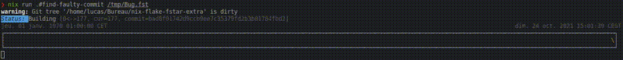

# Nix Flake F* Extra

Building on https://github.com/W95Psp/nix-flake-fstar, this repository is a flake which provides:
 - a list of F* master commits with their sha256 hashes (`nix eval --json 'github:W95Psp/nix-flake-fstar-extra#commits'`);
 - corresponding F* binaries (e.g. `nix run 'github:W95Psp/nix-flake-fstar-extra#fstar-bin-02ecab9dd1aa930bee842d77fa3564f24328e3d7' somemodule.fst`);
 - a list of F* pull-request patches with their sha256 hashes (`nix eval --json 'github:W95Psp/nix-flake-fstar-extra#commits'`);
 - corresponding patches (e.g. `nix build 'github:W95Psp/nix-flake-fstar-extra#pr-1909' -o 1909.patch` fetches the patch `1909.patch`);
 - a tool to find regressions (see below).

## Finding regressions
**Scenario:** *a function used to typecheck at some point (with some F* version). You want to identify the commit in F* history which broke your function*.

The following command will perform a dichotomic search to find the commit in the F* master branch history that breaks module `MODULE`. Timestamps `TIMESTAMP_MIN` and `TIMESTAMP_MAX` can be specified to slice the master branch history.

`nix run 'github:W95Psp/nix-flake-fstar-extra#find-faulty-commit' MODULE [TIMESTAMP_MIN] [TIMESTAMP_MAX]`

<!-- Note: to exclude intermediary commits from pull-requests, prepend `GIT_LOG_EXTRA_FLAGS="--first-parent master"` to the command. This will drastically reduce the number of commits to consider. -->

## Details

  
Full list of attributes availables

<!-- LIST -->

## Update
Commits and pull-requests are stored in `db.json` and `pull-requests.json`, to update them, clone this repo, and run `nix run .#update`. This will update the present README as well.

